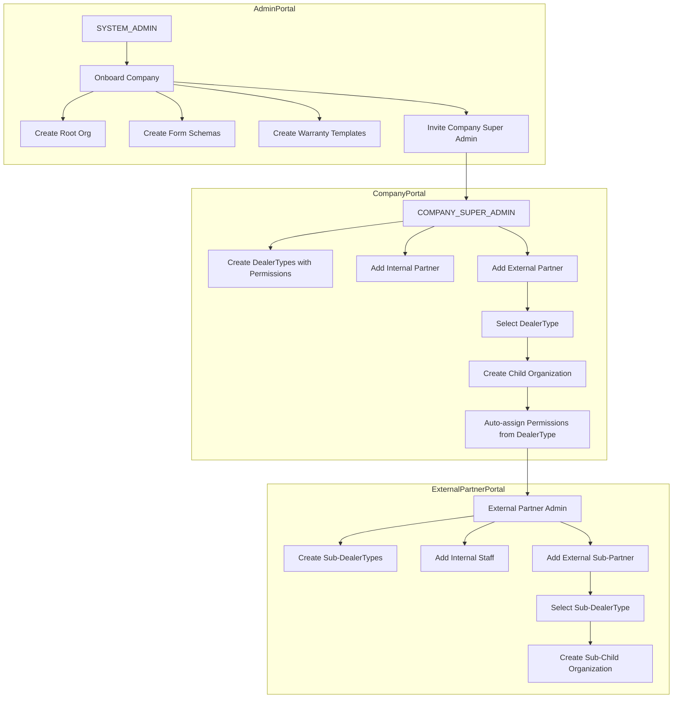

# Warranty Management System (WMS) - Product & Admin Flow Spec

This document defines the portals, roles, permissions model, and onboarding flows for building the Warranty Management System.

## Table of Contents
1. [Overview](#overview)
2. [Portals](#portals)
   - [Admin Portal (SYSTEM_ADMIN)](#admin-portal-system_admin)
   - [Company Portal (Company Users)](#company-portal-company-users)
   - [Consumer Portal (End Customers)](#consumer-portal-end-customers)
3. [Core Concepts](#core-concepts)
   - [User Ownership Rules](#user-ownership-rules)
   - [Organizations & Hierarchy](#organizations--hierarchy)
   - [Partner Creation: Internal vs External](#partner-creation-internal-vs-external)
   - [DealerType (Company-Defined Partner Categories)](#dealertype-company-defined-partner-categories)
   - [Hierarchical Branch Creation](#hierarchical-branch-creation)
   - [Partner Creation Flow Diagram](#partner-creation-flow-diagram)
   - [Real-World Examples](#real-world-examples)
   - [DealerType and Permission Auto-Assignment](#dealertype-and-permission-auto-assignment)
   - [Roles vs. Personas vs. Permissions](#roles-vs-personas-vs-permissions)
   - [Company Feature/Module Visibility (UI Access)](#company-featuremodule-visibility-ui-access)
4. [Key Features](#key-features)
   - [Dynamic Forms](#dynamic-forms)
   - [Dynamic Warranty Templates](#dynamic-warranty-templates)
   - [Custom Email Templates](#custom-email-templates)
5. [Flows](#flows)
   - [Company Onboarding (SYSTEM_ADMIN)](#company-onboarding-system_admin)
   - [User & Partner Invitation](#user--partner-invitation)
   - [Consumer Registration & Claims](#consumer-registration--claims)
6. [Roles & Access Rules](#roles--access-rules)

---

## Overview

The Warranty Management System is a multi-tenant platform that lets companies manage warranty workflows through configurable portals. Each company can have:
- custom form schemas (for products, claims, registrations, brands, categories, etc.) - configured by ADMIN,
- custom warranty templates and validation rules - configured by ADMIN,
- custom partner types (dealer/retailer/installer/repairer/etc.) - configured by Company Super Admin,
- custom user permissions and UI module visibility.

**Key distinction**: Form schemas and warranty templates are "Core Configuration" managed only by SYSTEM_ADMIN. Company Super Admin uses these schemas to add data but cannot modify the schema structure itself.

The onboarding starts with the platform admin team (SYSTEM_ADMIN) creating the company, enabling required modules, and creating form schemas + warranty templates. After handover, the company’s COMPANY_SUPER_ADMIN manages day-to-day operations: adding products, handling registrations/claims, creating partner types, and managing users/partners.

## Portals

### Admin Portal (SYSTEM_ADMIN)

Purpose: platform-wide administration and company onboarding.

System Admin can:
- **Onboard companies**: create the company root organization and base configuration (logo, currency, address, etc.).
- **Configure company modules/features**: enable what the company should see/use in the UI (examples: Claims, Products, Warranty Registration, Partner Types).
- **Create and manage form schemas** for each company (Core Configuration):
  - Product Form Schema (defines what fields a product has)
  - Claim Form Schema (defines what fields a claim has)
  - Registration Form Schema (defines what fields a product registration has)
  - Category/Brand/Fault/Issue schemas (as needed)
- **Create and manage warranty templates** for each company (Core Configuration):
  - Define warranty rules and conditions
  - Map rules to registration form schema fields
  - Set warranty terms, periods, and validation logic
- **Version control schemas and templates** when changes are needed
- **Invite the company’s COMPANY_SUPER_ADMIN** and optionally create additional initial company users.
- **View & manage onboarded companies**: list companies, inspect their configuration and records (admin visibility into system data).

**Important**: Form schemas and warranty templates are "Core Configuration" items managed only by SYSTEM_ADMIN. Company Super Admin cannot create, edit, or modify these - they can only USE them to add data (products, registrations, claims). The Admin Portal is the only place where system-level company configuration is created (modules, schemas, templates).

### Company Portal (Company Users)

Purpose: tenant-specific operations and configuration (within a single company context).

Company users include COMPANY_SUPER_ADMIN and COMPANY_PARTNER.

Suggested path-based tenant routing (single domain):
- Company Portal: `/{companySlug}/login` and `/{companySlug}/app/...`
- Consumer Portal: `/{companySlug}/consumer/...`
- Admin Portal: `/admin/...` (global)

Company Super Admin can:
- **Add products** (using the product form schema defined by ADMIN).
- **Add product registrations** (using the registration form schema defined by ADMIN).
- **Handle consumer claims** (using the claim form schema defined by ADMIN).
- **Manage brands, categories, faults, issues** (using respective schemas defined by ADMIN).
- **Create DealerTypes** (partner categories like Dealer, Retailer, Installer) with specific permissions.
- **Add partners/staff**:
  - **Internal** (partnerType: Internal): employees who belong to the same company org.
  - **External** (partnerType: External): partners who act as a new child organization + DealerType with auto-assigned permissions.
- **Define personas and permissions** for that company (granular permissions assigned to personas).
- **Control UI visibility for company roles**: only show permission toggles and modules that were enabled for that company by SYSTEM_ADMIN.

**Important**: Company Super Admin does NOT manage form schemas or warranty templates. These are "core configuration" items created and managed by SYSTEM_ADMIN during company onboarding.

**Partner Types (see Core Concepts for details):**
- **Internal** (partnerType: Internal): Staff who work directly in the company org. No new organization created.
- **External** (partnerType: External): a **branch organization** (child org) with DealerType. This branch can have its own Internal staff and create its own External branches (hierarchical).

### Consumer Portal (End Customers)

Purpose: end-customer self-service.

Consumers can:
- **Sign up / log in**
- **Register products** (depending on company configuration/workflow)
- **Initiate claims** for products they own/purchased, within the claim rules and form schema defined by the company
- **Track their claims** (status/history, as enabled by product scope)

Consumer registration for branch/partner sales (recommended):
- Registration should be scoped to the tenant (`rootOrgId`) and can optionally store `sellerOrgId` (branch/partner org) for routing and reporting.
- Best UX: the seller shares a registration link/QR like `/{companySlug}/consumer/register?code=XXXX` so the system can auto-resolve tenant + product + seller org.

## Core Concepts

### User Ownership Rules

**Company Super Admin ownership:**
- One user can be Company Super Admin of **multiple companies** (manages multiple businesses).
- One company has **one primary Company Super Admin** (the owner).
- Same user account, different company contexts.

**Consumer multi-company access:**
- One consumer can register products and initiate claims across **multiple company portals**.
- Same user account, different company contexts (registrations/claims per company).

### Organizations & Hierarchy

The platform is multi-tenant and organization-driven:
- A **Company** is represented by a **root organization** (parent org).
- **External partners = Branch organizations** - when you create an External partner, a new child organization (branch) is created.
- A child organization (branch) points to the parent via `rootOrgId`.
- Each branch can have its own Internal staff and create its own External partners (sub-branches).

### Partner Creation: Internal vs External

When Company Super Admin creates a partner/staff, they must specify two things:

1. **partnerType** (system-level): `Internal` or `External`
2. **DealerType** (company-defined): Only for External partners (e.g., Dealer, Retailer, Installer, Repairer)

#### Internal Partner (partnerType = Internal)

- Works directly in the company organization.
- **No separate organization created**.
- User belongs to the same company org (`orgId` = company root org).
- Permissions assigned based on persona/role within the company.
- Example: Support agents, warranty managers, quality auditors, sales staff.

#### External Partner (partnerType = External) = Branch Organization

- **A new branch organization (child org) is created** for this partner.
- Linked to parent company via `rootOrgId`.
- Must assign a **DealerType** (company-defined category with permissions).
- DealerType determines what permissions this branch organization has.
- This branch can have its own **Internal staff** and create its own **External partners** (sub-branches).
- Example: Dealers, retailers, installers, repairers, service centers.

### DealerType (Company-Defined Partner Categories)

Company Super Admin creates DealerTypes (partner categories) with specific permissions:

**How it works:**
1. Company Super Admin goes to "Partner Types" / "Dealer Types" section.
2. Creates a new DealerType (e.g., "Dealer", "Retailer", "Installer", "Repairer").
3. Toggles permissions for that DealerType (from modules enabled by SYSTEM_ADMIN).
4. When creating an External partner, selects this DealerType.
5. The new partner organization automatically gets permissions assigned from the DealerType.

**Example DealerTypes and Permissions:**
- **Dealer**: Products (view), Registration (create, view), Claims (view)
- **Retailer**: Products (view), Registration (create, view)
- **Installer**: Products (view), Registration (create, view), Claims (create)
- **Service Center**: Claims (view, update), Products (view)

### Hierarchical Branch Creation

External partners = Branch organizations. Each branch can create its own sub-branches:

**Flow:**
1. Company A creates External partner "Metro Dealers" with DealerType = "Dealer".
2. Metro Dealers **branch organization** is created under Company A.
3. Metro Dealers can now create their own partners:
   - **Internal staff** (Metro employees - no new org)
   - **External partners** (sub-branches under Metro - new org created)
4. Metro Dealers defines their own DealerTypes (e.g., "Sub-Dealer", "Local Installer").
5. Metro Dealers toggles permissions for their DealerTypes (subset of what Metro has).
6. Metro Dealers creates External partner "City Electronics" with DealerType = "Sub-Dealer".
7. City Electronics **branch organization** is created under Metro Dealers.

**Hierarchy (External = Branch):**
```
Company A (Root Organization)
├── Internal Staff (partnerType: Internal) - same org
└── Metro Dealers (partnerType: External, DealerType: Dealer) - BRANCH ORG
    ├── Internal Staff (partnerType: Internal) - same org as Metro
    └── City Electronics (partnerType: External, DealerType: Sub-Dealer) - SUB-BRANCH ORG
        └── Internal Staff (partnerType: Internal) - same org as City Electronics
```

**Permission Inheritance Rule:**
- A child partner cannot have more permissions than its parent.
- DealerTypes at lower levels can only toggle permissions that the parent has.

### Partner Creation Flow Diagram



### Real-World Examples

**Example 1: Simple Company with Internal and External Partners**

Admin onboards "Acme Electronics" (a TV manufacturer):
1. **ADMIN** creates Acme Electronics company, form schemas, warranty templates.
2. **ADMIN** invites User "John" as Company Super Admin.
3. **John** logs into Acme Electronics Company Portal.
4. **John** creates DealerTypes with permissions:
   - "Dealer" → Products (view), Registration (create, view), Claims (view)
   - "Retailer" → Products (view), Registration (create, view)
   - "Service Center" → Claims (view, update), Products (view)
5. **John** adds **Internal partners** (partnerType: Internal):
   - Support agents, warranty managers (no new org created, belong to Acme org)
6. **John** adds **External partner** (partnerType: External):
   - Partner Name: "Best Buy Store"
   - DealerType: "Dealer"
   - A new organization "Best Buy Store" is created under Acme
   - Permissions auto-assigned from "Dealer" DealerType

**Example 2: External Partner Creating Sub-Partners (Hierarchical)**

Acme Electronics has a major dealer "Metro Dealers":
1. **John** (Acme Super Admin) adds External partner "Metro Dealers" with DealerType = "Dealer".
2. A new organization "Metro Dealers" is created under Acme.
3. **John** invites User "Sarah" as admin of Metro Dealers organization.
4. **Sarah** logs into Metro Dealers portal.
5. **Sarah** creates her own DealerTypes (subset of Metro's permissions):
   - "Sub-Dealer" → Products (view), Registration (create)
   - "Local Installer" → Registration (view)
6. **Sarah** adds **Internal partners** (Metro employees).
7. **Sarah** adds **External partner** "City Electronics" with DealerType = "Sub-Dealer".
8. A new organization "City Electronics" is created under Metro Dealers.

**Resulting Hierarchy:**
```
Acme Electronics (Root Company)
├── Internal Partners (Acme employees - partnerType: Internal)
├── Best Buy Store (partnerType: External, DealerType: Dealer)
│   └── Internal Partners (Best Buy employees)
└── Metro Dealers (partnerType: External, DealerType: Dealer)
    ├── Internal Partners (Metro employees - partnerType: Internal)
    └── City Electronics (partnerType: External, DealerType: Sub-Dealer)
        └── Internal Partners (City Electronics employees)
```

**Example 3: User Managing Multiple Companies**

User "John" owns two businesses:
- ADMIN onboards "Acme Electronics" and assigns John as Company Super Admin.
- ADMIN onboards "Acme Home Appliances" and assigns John as Company Super Admin.
- John can switch between companies in the Company Portal.
- Each company has its own DealerTypes, permissions, products, etc. (using schemas created by ADMIN).
- John manages both businesses from the same user account.

**Example 4: Consumer Across Multiple Companies**

Consumer "Mike" buys products from multiple companies:
- Mike buys a TV from Acme Electronics dealer.
- Mike registers TV on Acme Electronics consumer portal (`/acme-electronics/register`).
- Mike buys a washing machine from another company "HomeAppliance Co".
- Mike registers washing machine on HomeAppliance Co consumer portal (`/homeappliance-co/register`).
- Mike uses the same email/account for both.
- Mike can view his registrations and claims per company.

### DealerType and Permission Auto-Assignment

**Permission Flow:**
1. **SYSTEM_ADMIN** enables modules for the company (Claims, Products, Registration, etc.).
2. **Company Super Admin** sees only enabled modules in permission toggles.
3. **Company Super Admin** creates DealerTypes (e.g., "Dealer", "Retailer") and toggles permissions for each.
4. When **Company Super Admin** creates an External partner and selects a DealerType, permissions are auto-assigned.

**Example Flow:**
1. Acme has modules enabled by ADMIN: Products, Claims, Registration.
2. John creates DealerType "Dealer" with permissions: Products (view), Registration (create, view).
3. John adds External partner "Best Buy Store" with DealerType = "Dealer".
4. Best Buy Store organization is created and automatically gets: Products (view), Registration (create, view).
5. All users in Best Buy Store organization inherit these permissions.

**Key Terms:**
- **partnerType**: System-level field with two values: `Internal` or `External`
- **DealerType**: Company-defined category (e.g., Dealer, Retailer, Installer) with toggled permissions
- Only **External** partners require a DealerType (because a new org is created with those permissions)
- **Internal** partners don't need a DealerType (they belong to the same org and get persona-based permissions)

### Roles vs. Personas vs. Permissions

This system separates three ideas:
- **Role**: broad system-level classification (e.g., SUPER_ADMIN, COMPANY_SUPER_ADMIN, COMPANY_PARTNER, CONSUMER).
- **Persona**: company-defined category for partner/user types (e.g., Dealer, Installer, SupportAgent). Personas are configured per company.
- **Permission**: granular capability flags that drive API access and UI visibility (examples: `CLAIMS`, `PRODUCTS`, `PRODUCT_FORM_SCHEMA`, `CLAIM_FORM_SCHEMA`, `PARTNER_TYPES`, `CAN_INVITE_PARTNER`).

A practical model is:
- Role decides which portal(s) a user can access.
- Persona + permissions decide what they can do inside the Company Portal.

### Company Feature/Module Visibility (UI Access)

Each company should only see what they purchased/require. This is controlled in two layers:

1) **Company Modules (enabled by SYSTEM_ADMIN)**
- Defines which modules exist for that tenant (e.g., Claims module ON/OFF, Product Schema Builder ON/OFF).
- If a module is disabled at the tenant level, it must not appear in the UI and must not be assignable via permissions.

2) **Company Permissions (managed by COMPANY_SUPER_ADMIN)**
- Within enabled modules, the company can create personas and assign permissions.
- UI shows permission toggles only for modules enabled for that company.

Example: if SYSTEM_ADMIN enabled `CLAIMS` and `CLAIM_FORM_SCHEMA`, then the Company Super Admin can decide which personas can access Claims and the claim schema builder. If `PRODUCT_FORM_SCHEMA` is not enabled, it should not appear anywhere in the Company Portal permission UI.

## Key Features

### Dynamic Forms
- Generate custom schemas tailored to company requirements.
- Supported schema types can include (based on enabled modules):
  - Product
  - Warranty/Registration
  - Claim
  - Brand / Category / Fault / Issue
  - Partner Types / Partner onboarding forms (if needed)

NOTE: may be we add more form schema to manage warranty management properly.

### Dynamic Warranty Templates
- Companies can define multiple warranty types and templates.
- Product selection determines which warranty template is attached/available.
- Templates support terms + rule validations at registration/claim time.

### Custom Email Templates
- Company admins can customize emails for system events.
- Example events: `REGISTRATION_CREATED`, `CLAIM_CREATED`, `CLAIM_UPDATED`, `REGISTRATION_UPDATED`.
- Templates support dynamic variables in subject and body (HTML/text).

## Flows

### Company Onboarding (SYSTEM_ADMIN)

1. **Requirement Gathering**
   - Identify which modules are needed for the company (Claims, Products, Registration, Partner Types, schemas, etc.).

2. **Create Root Organization**
   - Create company org + base info (logo/currency/address/etc.).

3. **Enable Company Modules**
   - Persist which modules are enabled for that tenant (this drives UI visibility + permission options).

4. **Create Form Schemas (Core Configuration)**
   - Create and configure form schemas (product, claim, registration, brand/category/fault/issue as required).
   - These schemas define what fields the company uses for each entity type.
   - Only SYSTEM_ADMIN can create/edit these.

5. **Create Warranty Templates (Core Configuration)**
   - Create warranty templates with rules and validation logic.
   - Map rules to registration form schema fields.
   - Only SYSTEM_ADMIN can create/edit these.

6. **Invite COMPANY_SUPER_ADMIN**
   - Send onboarding email to complete signup and verify account.

7. **Handover**
   - After signup, the COMPANY_SUPER_ADMIN can:
     - Add products (using the product schema created by ADMIN)
     - Add registrations, handle claims (using respective schemas)
     - Create **DealerTypes** with permissions (e.g., Dealer, Retailer, Installer)
     - Add **Internal partners** (partnerType: Internal) - belong to same org
     - Add **External partners** (partnerType: External) - creates new child org with DealerType
     - Define personas and permissions for company users
   - **COMPANY_SUPER_ADMIN cannot**: create/edit form schemas or warranty templates.

### User & Partner Invitation

1. **Invitation Created**
   - An admin (SYSTEM_ADMIN or COMPANY_SUPER_ADMIN) invites a user with name/email + target organization context.
   - For partners, specify: **partnerType** (Internal/External) and **DealerType** (if External).

2. **Email Trigger**
   - COMPANY_SUPER_ADMIN onboarding email (initial company admin).
   - COMPANY_PARTNER invitation email (internal or external partner user).

3. **Account + Organization Linking**
   - User account is created/activated on signup.
   - For **External partners** (partnerType: External):
     - Create a new child organization with selected DealerType.
     - Link to parent via `rootOrgId`.
     - Auto-assign permissions from DealerType.
   - For **Internal partners** (partnerType: Internal):
     - Link user to the company root org (no new org created).
     - Assign permissions based on persona.

4. **Permission Assignment**
   - **External partners**: get permissions from DealerType (auto-assigned to new org).
   - **Internal partners**: get permissions from assigned persona.

Note: a single user can be associated with multiple organizations (multi-org memberships), enabling the same user to operate under different company contexts if allowed.

### Consumer Registration & Claims

1. Consumer signs up / logs in.
2. Consumer registers a product (if the workflow requires registration first).
3. Consumer initiates a claim for an owned/registered product.
4. Claim fields/validation follow the company’s claim schema and warranty rules.

## Roles & Access Rules

- **SUPER_ADMIN**
  - Portals: Admin Portal (and can be granted visibility into Company/Consumer views if required for support)
  - Scope: global across all companies
  - Responsibilities: onboarding companies, enabling modules, **creating/managing form schemas and warranty templates** (core configuration), system-level oversight

- **COMPANY_SUPER_ADMIN**
  - Portals: Company Portal
  - Scope: full access within their company (root org and its hierarchy)
  - Responsibilities: add products, add registrations, handle claims, manage brands/categories/faults/issues, create **DealerTypes** with permissions, add Internal/External partners, define personas and permissions
  - **Cannot do**: create/edit form schemas or warranty templates (managed by SUPER_ADMIN)

- **COMPANY_PARTNER**
  - Portals: Company Portal (restricted)
  - Scope: permission-based within their organization context
  - **Internal partner** (partnerType: Internal): belongs to company root org, permissions from persona
  - **External partner** (partnerType: External): belongs to a child org with DealerType, permissions from DealerType

- **CONSUMER**
  - Portals: Consumer Portal
  - Scope: only their own registrations/products/claims

---

## Missing / Recommended Features to Add (Before Development)

These items are commonly needed in real warranty systems and help you avoid redesign later. You can mark them as **MVP** vs **Phase 2** based on timeline.

### Cross-cutting (All Portals)
- **Authentication & Security**
  - Cookie/JWT strategy, password policy, optional MFA, account lockout, refresh token rotation.
  - Role-based guards + permission checks (server-side enforcement, not only UI hiding).
- **Audit Logs (Highly Recommended)**
  - Track “who did what” for: module enablement, schema changes, permission changes, claim status changes, product edits.
  - Include timestamp, actor userId, orgId, action, before/after.
- **Notifications**
  - Email + optional in-app notifications; event-driven triggers (claim created/updated, registration approved, invitation sent/accepted).
- **File Uploads / Attachments**
  - Claim attachments (invoice, photos), registration documents, warranty PDFs.
- **Reporting & Dashboards**
  - KPIs by company/org: claims count by status, average resolution time, registrations over time, partner performance.
- **Search & Filters**
  - Global search for claims/registrations/products with pagination and export.
- **Data Ownership & Isolation**
  - Clear tenant boundary rules: root org vs child org access, consumer data visibility, cross-org access restrictions.
- **Standard Status Workflows**
  - Define allowed claim status transitions (e.g., SUBMITTED → IN_REVIEW → APPROVED/REJECTED → CLOSED).
- **Versioning Strategy**
  - Schema versioning (draft/published), warranty template versions, backward compatibility for existing registrations/claims.

### Admin Portal (SYSTEM_ADMIN) — Suggested Additions
- **Company Lifecycle**
  - Enable/disable company, suspend access, view tenant health/status.
- **Module Catalog / Plans**
  - Central list of available modules; enable/disable per company; (optional) plan/billing mapping.
- **Support Tools**
  - Impersonate company admin (read-only or controlled), reset company admin account, resend invitations.
- **System Templates**
  - Default schemas/templates that can be copied into a new company during onboarding.

### Company Portal — Suggested Additions
- **Partner Management Enhancements**
  - Partner onboarding workflow (invite → accept → complete profile), partner status (active/suspended).
- **Persona/Permission UX**
  - Permission groups by module, “select all”, copy persona, export/import role configuration.
- **Branch Management**
  - Branch org creation, assignment of staff, data scope rules (what parent can see from branches).
- **Claim Operations**
  - Assignment to staff, internal notes, SLA dates, escalation, comment timeline.
- **Email Template Testing**
  - Preview templates with sample data, test send, template versioning.

### Consumer Portal — Suggested Additions
- **Product Ownership Verification**
  - OTP/email verification, invoice upload, serial number validation, purchase date validation rules.
- **Claim Tracking**
  - Timeline view, status notifications, messaging/comments with support (optional).
- **Self-service Tools**
  - Resubmit missing info, edit profile, view registered products, download warranty certificate (optional).

### Module/Permission List (Recommend Defining Early)

To avoid ambiguity later, define a canonical list for:
- **Company modules** (tenant enable/disable): e.g., `PRODUCTS`, `CLAIMS`, `PARTNER_TYPES`, `PRODUCT_FORM_SCHEMA`, `CLAIM_FORM_SCHEMA`, `REGISTRATION`, `EMAIL_TEMPLATES`, `WARRANTY_TEMPLATES`
- **Permissions** (within enabled modules): module access + actions like `CAN_INVITE_USER`, `CAN_INVITE_PARTNER`, `CAN_MANAGE_PERSONAS`, `CAN_MANAGE_SCHEMAS`, `CAN_MANAGE_TEMPLATES`

Rule: **Permissions shown in Company Portal UI must be a subset of modules enabled by SYSTEM_ADMIN for that company.**
