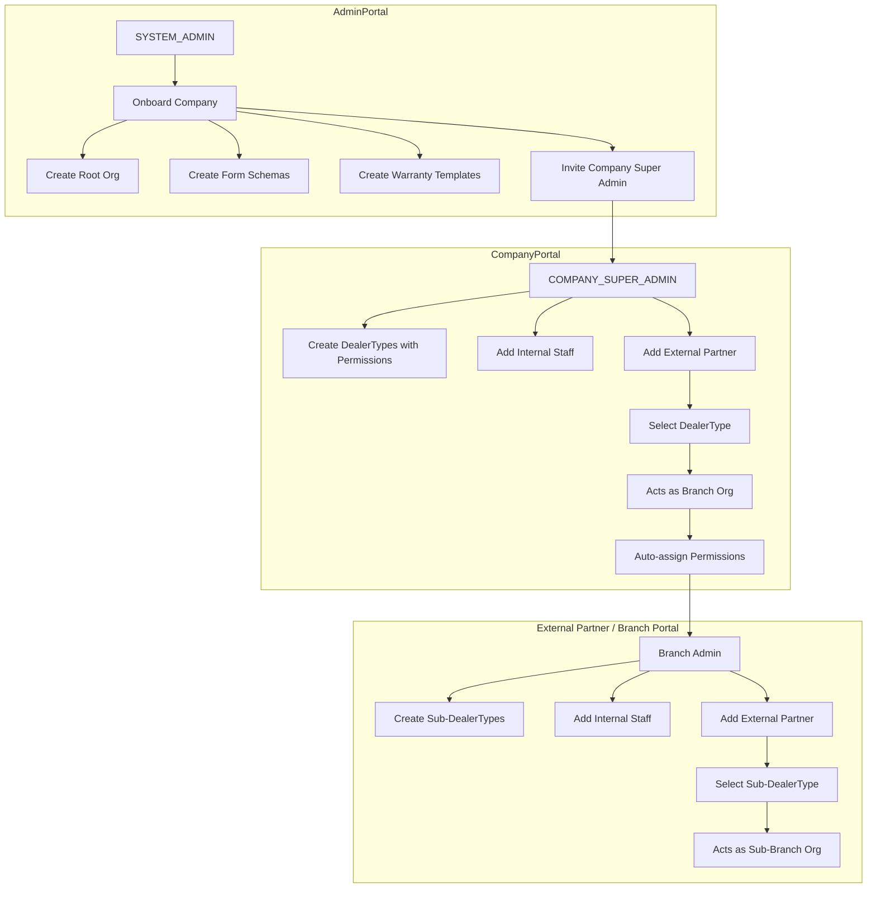

# Warranty Management System (WMS) - Product & Admin Flow Spec

This document defines the portals, roles, permissions model, and onboarding flows for building the Warranty Management System.

## Table of Contents
1. [Overview](#overview)
2. [Portals](#portals)
   - [Admin Portal (SYSTEM_ADMIN)](#admin-portal-system_admin)
   - [Company Portal (Company Users)](#company-portal-company-users)
   - [Consumer Portal (End Customers)](#consumer-portal-end-customers)
3. [Core Concepts](#core-concepts)
   - [User Data Model](#user-data-model)
   - [Organizations & Hierarchy](#organizations--hierarchy)
   - [Partner Creation: Internal vs External](#partner-creation-internal-vs-external)
   - [DealerType (Company-Defined Partner Categories)](#dealertype-company-defined-partner-categories)
   - [Hierarchical Branch Creation](#hierarchical-branch-creation)
   - [Partner Creation Flow Diagram](#partner-creation-flow-diagram)
   - [Real-World Examples](#real-world-examples)
   - [DealerType and Permission Auto-Assignment](#dealertype-and-permission-auto-assignment)
   - [Roles vs. DealerType vs. Permissions](#roles-vs-dealertype-vs-permissions)
   - [Company Feature/Module Visibility (UI Access)](#company-featuremodule-visibility-ui-access)
4. [Key Features](#key-features)
   - [Dynamic Forms](#dynamic-forms)
   - [Dynamic Warranty Templates](#dynamic-warranty-templates)
   - [Custom Email Templates](#custom-email-templates)
5. [Flows](#flows)
   - [Company Onboarding (SYSTEM_ADMIN)](#company-onboarding-system_admin)
   - [User & Partner Invitation](#user--partner-invitation)
   - [Consumer Registration & Claims](#consumer-registration--claims)
6. [Roles & Access Rules](#roles--access-rules)

---

## Overview

The Warranty Management System is a multi-tenant platform that lets companies manage warranty workflows through configurable portals. Each company can have:
- custom form schemas (for products, claims, registrations, brands, categories, etc.) - configured by ADMIN,
- custom warranty templates and validation rules - configured by ADMIN,
- custom partner types (dealer/retailer/installer/repairer/etc.) - configured by Company Super Admin,
- custom user permissions and UI module visibility.

**Key distinction**: Form schemas and warranty templates are "Core Configuration" managed only by SYSTEM_ADMIN. Company Super Admin uses these schemas to add data but cannot modify the schema structure itself.

The onboarding starts with the platform admin team (SYSTEM_ADMIN) creating the company, enabling required modules, and creating form schemas + warranty templates. After handover, the company’s COMPANY_SUPER_ADMIN manages day-to-day operations: adding products, handling registrations/claims, creating partner types, and managing users/partners.

## Portals

### Admin Portal (SYSTEM_ADMIN)

Purpose: platform-wide administration and company onboarding.

System Admin can:
- **Onboard companies**: create the company root organization and base configuration (logo, currency, address, etc.).
- **Configure company modules/features**: enable what the company should see/use in the UI (examples: Claims, Products, Warranty Registration, Partner Types).
- **Create and manage form schemas** for each company (Core Configuration):
  - Product Form Schema (defines what fields a product has)
  - Claim Form Schema (defines what fields a claim has)
  - Registration Form Schema (defines what fields a product registration has)
  - Category/Brand/Fault/Issue schemas (as needed)
  - Maybe in future we will add more form schema as per requirement to support all company types (like : Cars, Toys, Cloths, etc companies)
- **Create and manage warranty templates** for each company (Core Configuration):
  - Define warranty rules and conditions
  - Map rules to registration form schema fields
  - Set warranty terms, periods, and validation logic
- **Version control schemas and templates** when changes are needed
- **Invite the company’s COMPANY_SUPER_ADMIN** and optionally create additional initial company users.
- **View & manage onboarded companies**: list companies, inspect their configuration and records (admin visibility into system data).

**Important**: Form schemas and warranty templates are "Core Configuration" items managed only by SYSTEM_ADMIN. Company Super Admin cannot create, edit, or modify these - they can only USE them to add data (products, registrations, claims). The Admin Portal is the only place where system-level company configuration is created (modules, schemas, templates).

### Company Portal (Company Users)

Purpose: tenant-specific operations and configuration (within a single company context).

Company users include COMPANY_SUPER_ADMIN and COMPANY_PARTNER.

Suggested path-based tenant routing (single domain):
- Company Portal: `/{companySlug}/login` and `/{companySlug}/app/...`
- Consumer Portal: `/{companySlug}/consumer/...`
- Admin Portal: `/admin/...` (global)

Company Super Admin can:
- **Add products** (using the product form schema defined by ADMIN).
- **Add product registrations** (using the registration form schema defined by ADMIN).
- **Handle consumer claims** (using the claim form schema defined by ADMIN).
- **Manage brands, categories, faults, issues** (using respective schemas defined by ADMIN).
- **Create DealerTypes** for both Internal and External (e.g., SupportAgent, Dealer, Retailer, Installer) with specific permissions.
- **Add partners/staff**:
  - **Internal** (partnerType: Internal): employees who belong to the same company org + DealerType.
  - **External** (partnerType: External): partners who act as a new child organization + DealerType.
- Both Internal and External use **DealerType for permissions**. UI shown based on DealerType permissions when user logs in.
- **Control UI visibility for company roles**: only show permission toggles and modules that were enabled for that company by SYSTEM_ADMIN. The same restriction applies to child organizations: when creating partner types or personas, only permissions currently assigned to that organization can be toggled for new partners.

**Important**: Company Super Admin does NOT manage form schemas or warranty templates. These are "core configuration" items created and managed by SYSTEM_ADMIN during company onboarding.

**Partner Types (see Core Concepts for details):**
- **Internal** (partnerType: Internal): employees who belong to the same company org + DealerType for permissions.
- **External** (partnerType: External): partners who act as a new child organization (branch) + DealerType for permissions. Can have their own Internal staff and External partners.
- Both use **DealerType** for permissions. UI shown based on DealerType permissions.

### Consumer Portal (End Customers)

Purpose: end-customer self-service.

Consumers can:
- **Sign up / log in**
- **Register products** (depending on company configuration/workflow)
- **Initiate claims** for products they own/purchased, within the claim rules and form schema defined by the company
- **Track their claims** (status/history, as enabled by product scope)

Consumer registration for branch/partner sales (recommended):
- Registration should be scoped to the tenant (`rootOrgId`) and can optionally store `sellerOrgId` (branch/partner org) for routing and reporting.
- Best UX: the seller shares a registration link/QR like `/{companySlug}/consumer/register?code=XXXX` so the system can auto-resolve tenant + product + seller org.

## Core Concepts

### User Data Model

**Single User Table for All Roles:**
- All users are stored in a single **User** table regardless of role.
- User roles: `ADMIN`, `COMPANY_SUPER_ADMIN`, `COMPANY_STAFF`, `COMPANY_PARTNER`, `CONSUMER`
- The difference is defined by **relationships** to organizations.

**Role Definitions:**
| Role | Description | partnerType |
|------|-------------|-------------|
| `ADMIN` | Platform admin (global access) | - |
| `COMPANY_SUPER_ADMIN` | Organization admin (root company or branch) | - |
| `COMPANY_STAFF` | Internal workers/employees | Internal |
| `COMPANY_PARTNER` | External business partners who sell/manage warranties | External |
| `CONSUMER` | End customers who register products and file claims | - |

**User-Organization Relationship:**
- `ADMIN`: No organization relationship (global access)
- `COMPANY_SUPER_ADMIN`: Connected to an organization (root or branch) as admin
- `COMPANY_STAFF`: Connected to an organization + DealerType (partnerType: Internal)
- `COMPANY_PARTNER`: Connected to an organization + DealerType (partnerType: External)
- `CONSUMER`: Connected to registrations/claims per company (not directly to org)

**One User, Multiple Contexts:**
- A user can be COMPANY_SUPER_ADMIN of **multiple organizations** (manages multiple companies/branches).
- A user can be COMPANY_STAFF in **multiple organizations** (works for multiple branches).
- A user can be COMPANY_PARTNER in **multiple organizations** (partner with multiple companies).
- A consumer can register products across **multiple company portals** (same account, different company contexts).

### Organizations & Hierarchy

**Organization Data Model:**

Each organization has three key fields for hierarchy:
- **`root`**: Always points to the **main root organization** (top-level company)
- **`parentRoot`**: Points to the **immediate parent organization**
- **`children`**: List of **child organizations** under this org

**Hierarchy Example:**
```
Company A (Root) → Company B (Branch 1) → Company C (Branch 1.1)
```

**Organization Records:**
| Organization | root | parentRoot | children |
|--------------|------|------------|----------|
| Company A | Company A (self) | null | [Company B] |
| Company B | Company A | Company A | [Company C] |
| Company C | Company A | Company B | [] |

**Key Rules:**
- `root` always points to the **top-level company** (never changes down the hierarchy)
- `parentRoot` points to the **immediate parent** (one level up)
- Root organization has `parentRoot = null`
- A branch's `root` is always the same as its parent's `root`

**User-Organization Connection:**
- Users connect to organizations through a **Membership** relation
- Membership includes: `userId`, `orgId`, `dealerTypeId`, `role`
- This allows:
  - One user to belong to multiple organizations
  - Same user to have different DealerTypes in different orgs
  - Tracking which org a user belongs to

**Internal vs External Staff:**
- **Internal staff (COMPANY_STAFF)**: User's `orgId` = same as company org (no new org created)
- **External partners (COMPANY_PARTNER)**: New organization created, user's `orgId` = new branch org
- **Both use DealerType** for permissions. UI shown based on DealerType.

### Partner Creation: Internal vs External

When Company Super Admin creates a partner/staff, they must specify:

1. **partnerType** (system-level): `Internal` or `External`
2. **Role**: `COMPANY_STAFF` (Internal) or `COMPANY_PARTNER` (External)
3. **DealerType** (company-defined): applies to both (e.g., SupportAgent, Dealer, Retailer)

**Both COMPANY_STAFF and COMPANY_PARTNER use DealerType for permissions.** The key difference:
- **COMPANY_STAFF** = Internal workers, same org, no new org created
- **COMPANY_PARTNER** = External business partners, new branch org created

#### Internal (partnerType = Internal) → Role: COMPANY_STAFF

- Internal workers/employees who belong to the same company org.
- **No new organization created**.
- User belongs to the same org (`orgId` = company root org or parent branch org).
- Assign a **DealerType** → permissions auto-assigned.
- UI shown based on DealerType permissions.
- Example DealerTypes: SupportAgent, WarrantyManager, QualityAuditor, SalesStaff.

#### External (partnerType = External) → Role: COMPANY_PARTNER = Branch Organization

- External business partners who **act as a new child organization** (branch).
- Linked to parent via `rootOrgId`.
- Assign a **DealerType** → permissions auto-assigned to the branch org.
- UI shown based on DealerType permissions.
- Can have their own **Internal staff** and **External partners** (sub-branches).
- Example DealerTypes: Dealer, Retailer, Installer, Repairer, ServiceCenter.

### DealerType (Company-Defined Partner Categories)

Company Super Admin creates DealerTypes for **both Internal and External** partners with specific permissions:

**How it works:**
1. Company Super Admin goes to "Partner Types" / "Dealer Types" section.
2. Creates DealerTypes for Internal staff (e.g., "SupportAgent", "WarrantyManager").
3. Creates DealerTypes for External partners (e.g., "Dealer", "Retailer", "Installer").
4. Toggles permissions for each DealerType (from modules enabled by SYSTEM_ADMIN).
5. When creating a partner (Internal or External), selects the appropriate DealerType.
6. Permissions and persona auto-assigned from DealerType.
7. UI shown based on DealerType permissions when user logs in.

**Example DealerTypes for Internal Staff:**
- **SupportAgent**: Claims (view, update), Products (view)
- **WarrantyManager**: Claims (view, update, approve), Registration (view), Products (view)
- **QualityAuditor**: Claims (view), Products (view), Reports (view)

**Example DealerTypes for External Partners:**
- **Dealer**: Products (view), Registration (create, view), Claims (view)
- **Retailer**: Products (view), Registration (create, view)
- **Installer**: Products (view), Registration (create, view), Claims (create)
- **ServiceCenter**: Claims (view, update), Products (view)

### Hierarchical Branch Creation

External partners act as branch organizations. Each branch can have its own Internal staff and External partners:

**Flow:**
1. Company A adds External partner "Metro Dealers" with DealerType = "Dealer".
2. Metro Dealers acts as a **branch organization** under Company A.
3. Metro Dealers can now add their own partners:
   - **Internal** (Metro employees - belong to Metro org)
   - **External** (sub-branches under Metro - new child org)
4. Metro Dealers creates their own DealerTypes (e.g., "Sub-Dealer", "Local Installer").
5. Metro Dealers toggles permissions for their DealerTypes (subset of what Metro has).
6. Metro Dealers adds External partner "City Electronics" with DealerType = "Sub-Dealer".
7. City Electronics acts as a **sub-branch organization** under Metro Dealers.

**Hierarchy Diagram:**
```
Company A (Root Organization)
├── Internal (employees in Company A org)
└── Metro Dealers (External, DealerType: Dealer) - BRANCH
    ├── Internal (employees in Metro org)
    └── City Electronics (External, DealerType: Sub-Dealer) - SUB-BRANCH
        └── Internal (employees in City Electronics org)
```

**Organization Records (root/parentRoot structure):**
| Organization | root | parentRoot | children |
|--------------|------|------------|----------|
| Company A | Company A | null | [Metro Dealers] |
| Metro Dealers | Company A | Company A | [City Electronics] |
| City Electronics | Company A | Metro Dealers | [] |

**Key Points:**
- `root` is always **Company A** (the top-level company) for all organizations in this hierarchy
- `parentRoot` is the **immediate parent** (one level up)
- This structure allows easy traversal: find all orgs under a root, find parent chain, etc.

**Permission Inheritance Rule:**
- A child partner cannot have more permissions than its parent.
- DealerTypes at lower levels can only toggle permissions that the parent has.

### Partner Creation Flow Diagram



### Real-World Examples

**Example 1: Simple Company with Internal and External Staff**

Admin onboards "Acme Electronics" (a TV manufacturer):
1. **ADMIN** creates Acme Electronics company, form schemas, warranty templates.
2. **ADMIN** invites User "John" as Company Super Admin (role: `COMPANY_SUPER_ADMIN`).
3. **John** logs into Acme Electronics Company Portal.
4. **John** creates DealerTypes with permissions:
   - **For COMPANY_STAFF:** "SupportAgent" → Claims (view, update), Products (view)
   - **For COMPANY_STAFF:** "WarrantyManager" → Claims (view, update, approve), Products (view)
   - **For COMPANY_PARTNER:** "Dealer" → Products (view), Registration (create, view), Claims (view)
   - **For COMPANY_PARTNER:** "Retailer" → Products (view), Registration (create, view)
5. **John** adds **COMPANY_STAFF** (Internal workers):
   - Alice as "SupportAgent" → role: `COMPANY_STAFF`, sees Claims and Products in UI
   - Bob as "WarrantyManager" → role: `COMPANY_STAFF`, sees Claims (with approve) and Products in UI
6. **John** adds **COMPANY_PARTNER** (External partner):
   - Partner Name: "Best Buy Store"
   - DealerType: "Dealer"
   - Best Buy Store acts as a branch organization under Acme
   - Best Buy admin gets role: `COMPANY_SUPER_ADMIN` of Best Buy org
   - Best Buy workers get role: `COMPANY_STAFF` with appropriate DealerType

**Example 2: External Partner Creating Sub-Partners (Hierarchical)**

Acme Electronics has a major dealer "Metro Dealers":
1. **John** (Acme Super Admin) adds External partner "Metro Dealers" with DealerType = "Dealer".
2. Metro Dealers acts as a branch organization under Acme.
3. **John** invites User "Sarah" as admin of Metro Dealers (role: `COMPANY_SUPER_ADMIN` of Metro).
4. **Sarah** logs into Metro Dealers portal.
5. **Sarah** creates her own DealerTypes (subset of Metro's permissions):
   - **For Internal:** "MetroStaff" → Products (view), Registration (view)
   - **For External:** "Sub-Dealer" → Products (view), Registration (create)
6. **Sarah** adds **Internal** staff with DealerType = "MetroStaff" (Metro employees).
7. **Sarah** adds **External** partner "City Electronics" with DealerType = "Sub-Dealer".
8. City Electronics acts as a sub-branch organization under Metro Dealers.

**Resulting Hierarchy:**
```
Acme Electronics (Root Company)
├── Internal (DealerType: SupportAgent, WarrantyManager)
├── Best Buy Store (External, DealerType: Dealer)
│   └── Internal (Best Buy employees with DealerType)
└── Metro Dealers (External, DealerType: Dealer)
    ├── Internal (DealerType: MetroStaff)
    └── City Electronics (External, DealerType: Sub-Dealer)
        └── Internal (City Electronics employees with DealerType)
```

**Organization Records (root/parentRoot):**
| Organization | root | parentRoot | children |
|--------------|------|------------|----------|
| Acme Electronics | Acme Electronics | null | [Best Buy, Metro Dealers] |
| Best Buy Store | Acme Electronics | Acme Electronics | [] |
| Metro Dealers | Acme Electronics | Acme Electronics | [City Electronics] |
| City Electronics | Acme Electronics | Metro Dealers | [] |

**User-Organization Memberships:**
| User | Organization | DealerType | Role | partnerType |
|------|--------------|------------|------|-------------|
| John | Acme Electronics | - | COMPANY_SUPER_ADMIN | - |
| Alice | Acme Electronics | SupportAgent | COMPANY_STAFF | Internal |
| Bob | Acme Electronics | WarrantyManager | COMPANY_STAFF | Internal |
| Sarah | Metro Dealers | - | COMPANY_SUPER_ADMIN | - (branch admin) |
| (Metro worker) | Metro Dealers | MetroStaff | COMPANY_STAFF | Internal |
| (City admin) | City Electronics | - | COMPANY_SUPER_ADMIN | - (sub-branch admin) |
| (City worker) | City Electronics | CityStaff | COMPANY_STAFF | Internal |

**Example 3: User Managing Multiple Companies**

User "John" owns two businesses:
- ADMIN onboards "Acme Electronics" and assigns John as Company Super Admin.
- ADMIN onboards "Acme Home Appliances" and assigns John as Company Super Admin.
- John can switch between companies in the Company Portal.
- Each company has its own DealerTypes, permissions, products, etc. (using schemas created by ADMIN).
- John manages both businesses from the same user account.

**Example 4: Consumer Across Multiple Companies**

Consumer "Mike" buys products from multiple companies:
- Mike buys a TV from Acme Electronics dealer.
- Mike registers TV on Acme Electronics consumer portal (`/acme-electronics/register`).
- Mike buys a washing machine from another company "HomeAppliance Co".
- Mike registers washing machine on HomeAppliance Co consumer portal (`/homeappliance-co/register`).
- Mike uses the same email/account for both.
- Mike can view his registrations and claims per company.

### DealerType and Permission Auto-Assignment

**Permission Flow:**
1. **SYSTEM_ADMIN** enables modules for the company (Claims, Products, Registration, etc.).
2. **Company Super Admin** sees only enabled modules in permission toggles.
3. **Company Super Admin** creates DealerTypes for **both Internal and External** (e.g., "SupportAgent", "Dealer", "Retailer").
4. When **Company Super Admin** creates a partner (Internal or External), selects a DealerType.
5. Permissions auto-assigned from DealerType. UI shown based on these permissions.

**Example Flow - Internal Staff:**
1. Acme has modules enabled by ADMIN: Products, Claims, Registration.
2. John creates DealerType "SupportAgent" with permissions: Claims (view, update), Products (view).
3. John adds Internal staff "Alice" with DealerType = "SupportAgent".
4. Alice belongs to Acme org and sees UI based on SupportAgent permissions.

**Example Flow - External Partner:**
1. John creates DealerType "Dealer" with permissions: Products (view), Registration (create, view).
2. John adds External partner "Best Buy Store" with DealerType = "Dealer".
3. Best Buy Store acts as a branch org with auto-assigned permissions.
4. All users in Best Buy Store see UI based on Dealer permissions.

**Key Terms:**
- **partnerType**: System-level field with two values: `Internal` or `External`
- **Role**: `COMPANY_STAFF` (Internal) or `COMPANY_PARTNER` (External)
- **DealerType**: Company-defined category with permissions (applies to both roles)
- **Internal (COMPANY_STAFF)**: employees belonging to same org + DealerType for permissions
- **External (COMPANY_PARTNER)**: partners acting as branch org + DealerType for permissions

### Roles vs. DealerType vs. Permissions

This system separates three ideas:
- **Role**: system-level classification that determines portal access and partnerType:
  - `ADMIN` - Platform admin
  - `COMPANY_SUPER_ADMIN` - Organization admin
  - `COMPANY_STAFF` - Internal workers (partnerType: Internal)
  - `COMPANY_PARTNER` - External partners (partnerType: External)
  - `CONSUMER` - End customers
- **DealerType**: company-defined category with specific permissions (e.g., SupportAgent, Dealer, Installer).
- **Permission**: granular capability flags that drive API access and UI visibility (examples: `CLAIMS`, `PRODUCTS`, `REGISTRATION`, `PARTNER_TYPES`, `CAN_INVITE_PARTNER`).

A practical model is:
- **Role** decides which portal(s) a user can access and whether they are Internal or External.
- **DealerType** decides what permissions they have and what UI they see inside the Company Portal.
- Both `COMPANY_STAFF` and `COMPANY_PARTNER` use DealerType for permissions.

### Company Feature/Module Visibility (UI Access)

Each company should only see what they purchased/require. This is controlled in two layers:

1) **Company Modules (enabled by SYSTEM_ADMIN)**
- Defines which modules exist for that tenant (e.g., Claims module ON/OFF, Product Schema Builder ON/OFF).
- If a module is disabled at the tenant level, it must not appear in the UI and must not be assignable via permissions.

2) **Company Permissions (managed by COMPANY_SUPER_ADMIN)**
- Within enabled modules, the company can create personas and assign permissions.
- UI shows permission toggles only for modules enabled for that company.

Example: if SYSTEM_ADMIN enabled `CLAIMS` and `CLAIM_FORM_SCHEMA`, then the Company Super Admin can decide which personas can access Claims and the claim schema builder. If `PRODUCT_FORM_SCHEMA` is not enabled, it should not appear anywhere in the Company Portal permission UI.

## Key Features

### Dynamic Forms
- Generate custom schemas tailored to company requirements.
- Supported schema types can include (based on enabled modules):
  - Product
  - Warranty/Registration
  - Claim
  - Brand / Category / Fault / Issue
  - Partner Types / Partner onboarding forms (if needed)

NOTE: may be we add more form schema to manage warranty management properly.

### Dynamic Warranty Templates
- Companies can define multiple warranty types and templates.
- Product selection determines which warranty template is attached/available.
- Templates support terms + rule validations at registration/claim time.

### Custom Email Templates
- Company admins can customize emails for system events.
- Example events: `REGISTRATION_CREATED`, `CLAIM_CREATED`, `CLAIM_UPDATED`, `REGISTRATION_UPDATED`.
- Templates support dynamic variables in subject and body (HTML/text).

## Flows

### Company Onboarding (SYSTEM_ADMIN)

1. **Requirement Gathering**
   - Identify which modules are needed for the company (Claims, Products, Registration, Partner Types, schemas, etc.).

2. **Create Root Organization**
   - Create company org + base info (logo/currency/address/etc.).

3. **Enable Company Modules**
   - Persist which modules are enabled for that tenant (this drives UI visibility + permission options).

4. **Create Form Schemas (Core Configuration)**
   - Create and configure form schemas (product, claim, registration, brand/category/fault/issue as required).
   - These schemas define what fields the company uses for each entity type.
   - Only SYSTEM_ADMIN can create/edit these.

5. **Create Warranty Templates (Core Configuration)**
   - Create warranty templates with rules and validation logic.
   - Map rules to registration form schema fields.
   - Only SYSTEM_ADMIN can create/edit these.

6. **Invite COMPANY_SUPER_ADMIN**
   - Send onboarding email to complete signup and verify account.

7. **Handover**
   - After signup, the COMPANY_SUPER_ADMIN can:
     - Add products (using the product schema created by ADMIN)
     - Add registrations, handle claims (using respective schemas)
     - Create **DealerTypes** for both Internal and External (e.g., SupportAgent, Dealer, Retailer)
     - Add **COMPANY_STAFF** (Internal workers - same org + DealerType)
     - Add **COMPANY_PARTNER** (External partners - branch org + DealerType)
     - UI shown based on DealerType permissions when staff logs in
   - **COMPANY_SUPER_ADMIN cannot**: create/edit form schemas or warranty templates.

### User & Partner Invitation

1. **Invitation Created**
   - An admin (SYSTEM_ADMIN or COMPANY_SUPER_ADMIN) invites a user with name/email + target organization context.
   - For partners, specify: **partnerType** (Internal/External) and **DealerType** (for both Internal and External).

2. **Email Trigger**
   - COMPANY_SUPER_ADMIN onboarding email (initial company/branch admin).
   - COMPANY_STAFF invitation email (internal workers).
   - COMPANY_PARTNER invitation email (external partner users).

3. **Account + Organization Linking**
   - User account is created/activated on signup.
   - For **External** (partnerType: External):
     - Partner acts as a new child organization (branch) with selected DealerType.
     - Link to parent via `rootOrgId`.
   - For **Internal** (partnerType: Internal):
     - User belongs to the same company org (no new org created).

4. **Permission Assignment**
   - **Both Internal and External** get permissions from assigned DealerType.
   - UI shown based on DealerType permissions when user logs in.

Note: a single user can be associated with multiple organizations (multi-org memberships), enabling the same user to operate under different company contexts if allowed.

### Consumer Registration & Claims

1. Consumer signs up / logs in.
2. Consumer registers a product (if the workflow requires registration first).
3. Consumer initiates a claim for an owned/registered product.
4. Claim fields/validation follow the company’s claim schema and warranty rules.

## Roles & Access Rules

| Role | Portal | partnerType | Description |
|------|--------|-------------|-------------|
| `ADMIN` | Admin Portal | - | Platform admin with global access |
| `COMPANY_SUPER_ADMIN` | Company Portal | - | Organization admin (root or branch) |
| `COMPANY_STAFF` | Company Portal | Internal | Internal workers/employees |
| `COMPANY_PARTNER` | Company Portal | External | External business partners |
| `CONSUMER` | Consumer Portal | - | End customers |

- **ADMIN** (SUPER_ADMIN)
  - Portals: Admin Portal (and can be granted visibility into Company/Consumer views if required for support)
  - Scope: global across all companies
  - Responsibilities: onboarding companies, enabling modules, **creating/managing form schemas and warranty templates** (core configuration), system-level oversight

- **COMPANY_SUPER_ADMIN**
  - Portals: Company Portal
  - Scope: full access within their organization (root company or branch)
  - Can be admin of root company OR admin of a branch organization
  - Responsibilities: add products, add registrations, handle claims, manage brands/categories/faults/issues, create **DealerTypes**, add Internal staff (COMPANY_STAFF) and External partners (COMPANY_PARTNER)
  - **Cannot do**: create/edit form schemas or warranty templates (managed by ADMIN)

- **COMPANY_STAFF** (partnerType: Internal)
  - Portals: Company Portal (restricted)
  - Scope: permission-based within their organization context
  - Internal workers/employees who belong to the same org
  - Permissions from assigned DealerType (e.g., SupportAgent, WarrantyManager)
  - UI shown based on DealerType permissions

- **COMPANY_PARTNER** (partnerType: External)
  - Portals: Company Portal (restricted)
  - Scope: permission-based within their organization context
  - External business partners who sell/manage warranties
  - Belong to a branch organization
  - Permissions from assigned DealerType (e.g., Dealer, Retailer, Installer)
  - UI shown based on DealerType permissions

- **CONSUMER**
  - Portals: Consumer Portal
  - Scope: only their own registrations/products/claims

---

## Missing / Recommended Features to Add (Before Development)

These items are commonly needed in real warranty systems and help you avoid redesign later. You can mark them as **MVP** vs **Phase 2** based on timeline.

### Cross-cutting (All Portals)
- **Authentication & Security**
  - Cookie/JWT strategy, password policy, optional MFA, account lockout, refresh token rotation.
  - Role-based guards + permission checks (server-side enforcement, not only UI hiding).
- **Audit Logs (Highly Recommended)**
  - Track “who did what” for: module enablement, schema changes, permission changes, claim status changes, product edits.
  - Include timestamp, actor userId, orgId, action, before/after.
- **Notifications**
  - Email + optional in-app notifications; event-driven triggers (claim created/updated, registration approved, invitation sent/accepted).
- **File Uploads / Attachments**
  - Claim attachments (invoice, photos), registration documents, warranty PDFs.
- **Reporting & Dashboards**
  - KPIs by company/org: claims count by status, average resolution time, registrations over time, partner performance.
- **Search & Filters**
  - Global search for claims/registrations/products with pagination and export.
- **Data Ownership & Isolation**
  - Clear tenant boundary rules: root org vs child org access, consumer data visibility, cross-org access restrictions.
- **Standard Status Workflows**
  - Define allowed claim status transitions (e.g., SUBMITTED → IN_REVIEW → APPROVED/REJECTED → CLOSED).
- **Versioning Strategy**
  - Schema versioning (draft/published), warranty template versions, backward compatibility for existing registrations/claims.

### Admin Portal (SYSTEM_ADMIN) — Suggested Additions
- **Company Lifecycle**
  - Enable/disable company, suspend access, view tenant health/status.
- **Module Catalog / Plans**
  - Central list of available modules; enable/disable per company; (optional) plan/billing mapping.
- **Support Tools**
  - Impersonate company admin (read-only or controlled), reset company admin account, resend invitations.
- **System Templates**
  - Default schemas/templates that can be copied into a new company during onboarding.

### Company Portal — Suggested Additions
- **Partner Management Enhancements**
  - Partner onboarding workflow (invite → accept → complete profile), partner status (active/suspended).
- **Persona/Permission UX**
  - Permission groups by module, “select all”, copy persona, export/import role configuration.
- **Branch Management**
  - Branch org creation, assignment of staff, data scope rules (what parent can see from branches).
- **Claim Operations**
  - Assignment to staff, internal notes, SLA dates, escalation, comment timeline.
- **Email Template Testing**
  - Preview templates with sample data, test send, template versioning.

### Consumer Portal — Suggested Additions
- **Product Ownership Verification**
  - OTP/email verification, invoice upload, serial number validation, purchase date validation rules.
- **Claim Tracking**
  - Timeline view, status notifications, messaging/comments with support (optional).
- **Self-service Tools**
  - Resubmit missing info, edit profile, view registered products, download warranty certificate (optional).

### Module/Permission List (Recommend Defining Early)

To avoid ambiguity later, define a canonical list for:
- **Company modules** (tenant enable/disable): e.g., `PRODUCTS`, `CLAIMS`, `PARTNER_TYPES`, `PRODUCT_FORM_SCHEMA`, `CLAIM_FORM_SCHEMA`, `REGISTRATION`, `EMAIL_TEMPLATES`, `WARRANTY_TEMPLATES`
- **Permissions** (within enabled modules): module access + actions like `CAN_INVITE_USER`, `CAN_INVITE_PARTNER`, `CAN_MANAGE_PERSONAS`, `CAN_MANAGE_SCHEMAS`, `CAN_MANAGE_TEMPLATES`

Rule: **Permissions shown in Company Portal UI must be a subset of modules enabled by SYSTEM_ADMIN for that company.**
