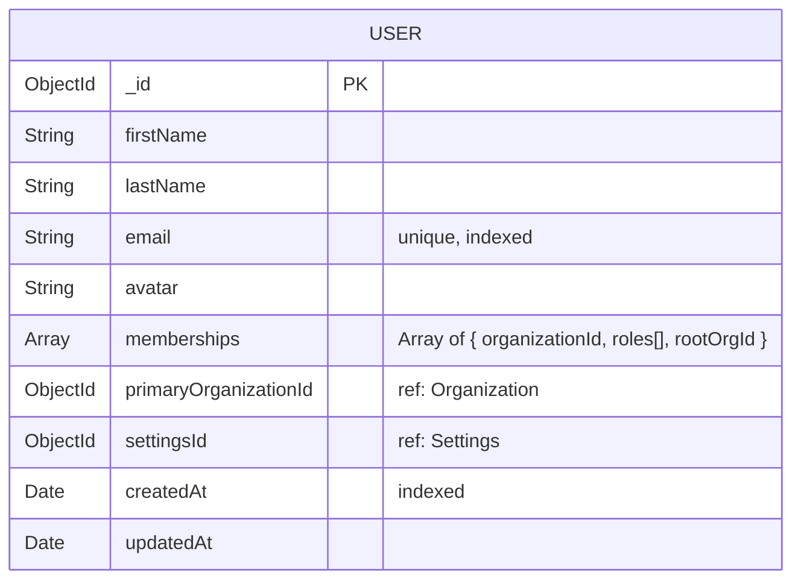
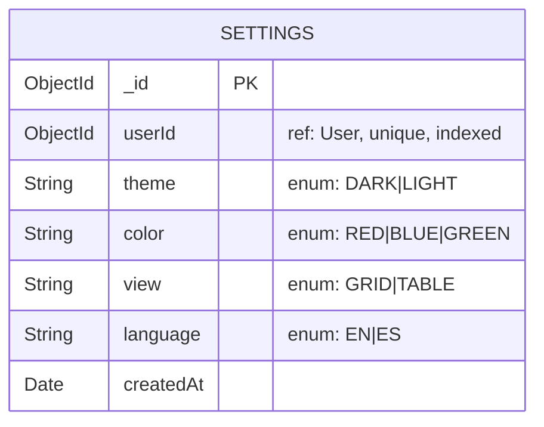
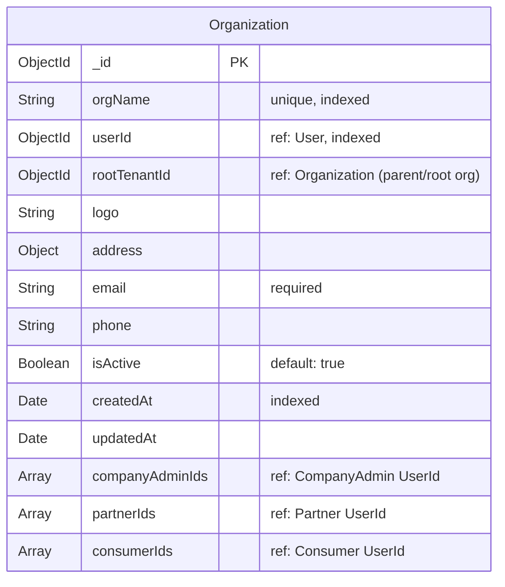
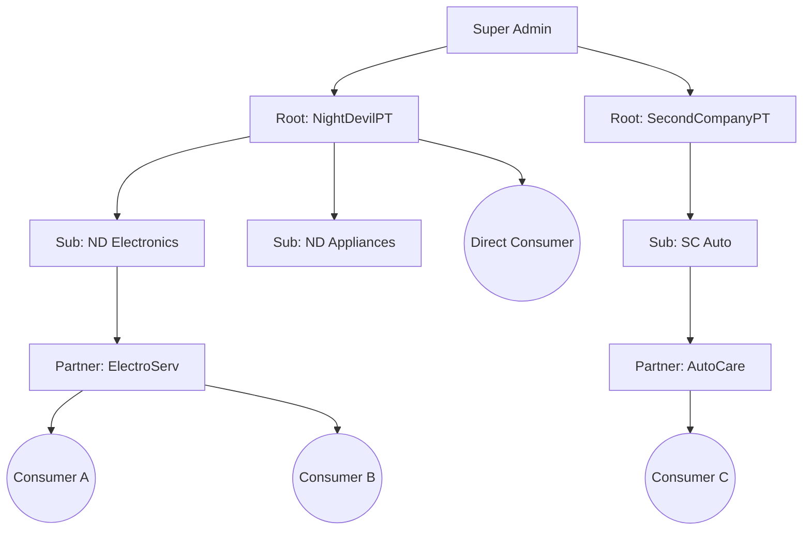

# Warranty Management System Documentation

## Role Definitions

```ts
enum ROLES {
  ADMIN
  COMPANY_ADMIN
  PARTNER
  CONSUMER
}
```

## Database Schema

### User Collection



#### Example of Roles

```json
[
  { "organizationId": "global", "roles": ["ADMIN"] },
  { "organizationId": "Org1", "roles": ["COMPANY_ADMIN"] },
  { "organizationId": "Org2", "roles": ["PARTNER", "CONSUMER"] }
    {
      "organizationId": "global",
      "roles": ["ADMIN"],
    },
    {
      "organizationId": "org_electronics",
      "roles": ["COMPANY_ADMIN"],
      "rootOrgId": "org_electronics"
    },
    {
      "organizationId": "org_appliances",
      "roles": ["PARTNER", "CONSUMER"],
      "rootOrgId": "org_electronics"
    }
]
```

### Settings Collection



## Administrative Privileges

### Admin Dashboard Functionality

#### Company Management

- View all registered companies
- Create/update company profiles and associated user records
- Company-specific operations:
  - **Company Details**: Full CRUD capabilities
  - **Warranty Templates**: Manage templates (CRUD)

#### Form Configuration

- Customizable form schemas:
  - Product : Dynamic Form Schema
  - Issue : Dynamic Form Schema
  - Categories : Dynamic Form Schema
  - Brands : Dynamic Form Schema
  - Fault : Dynamic Form Schema

#### Templates

- Customizable Templates
  - Email Templates
  - Warranty Templates

---

### Organization Collection



### Hierarchy Flow: Super Admin / Company Admin / Organization / Consumer


