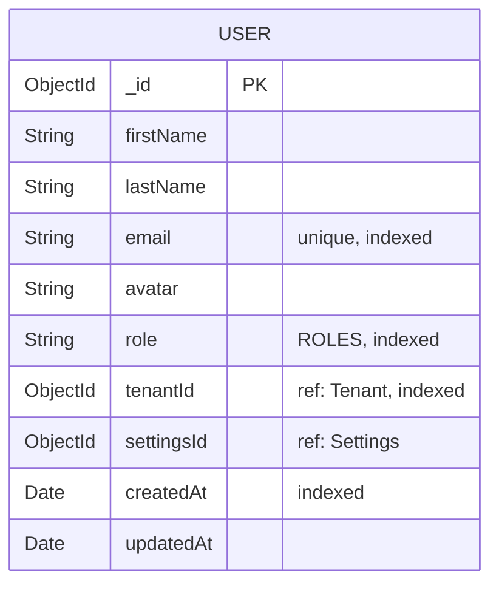
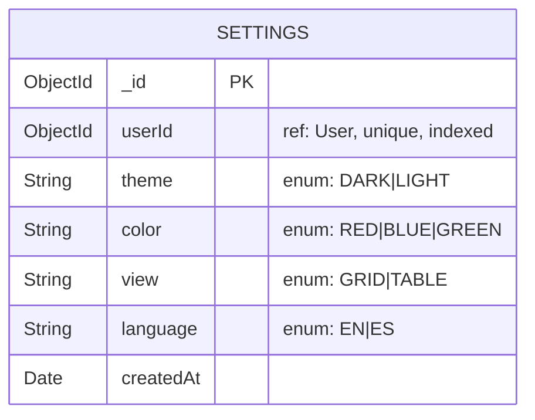
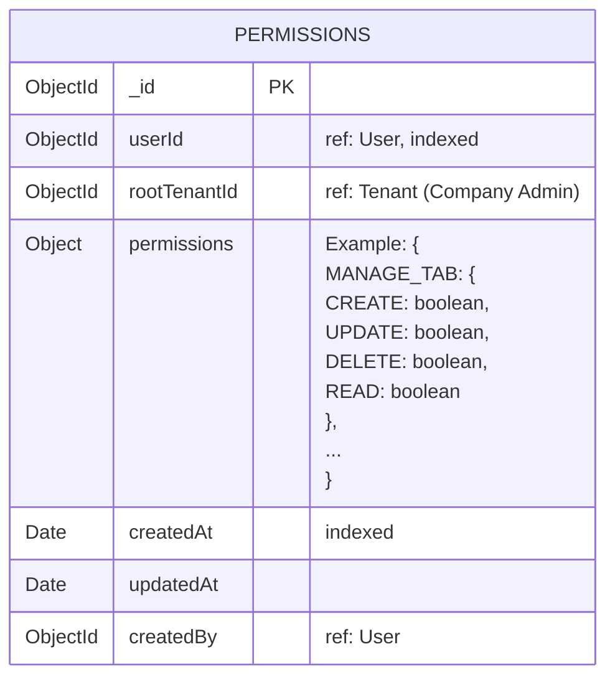
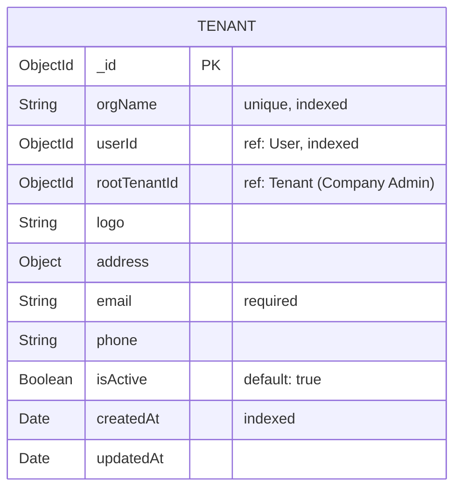
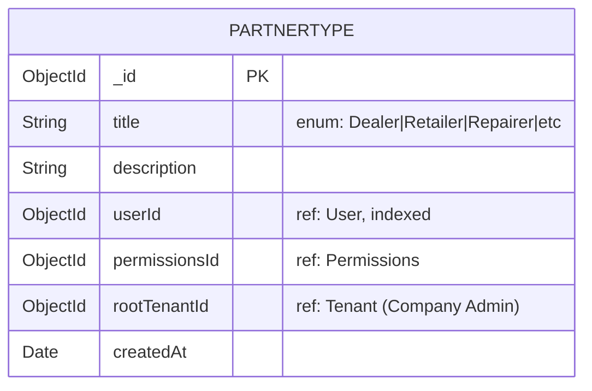
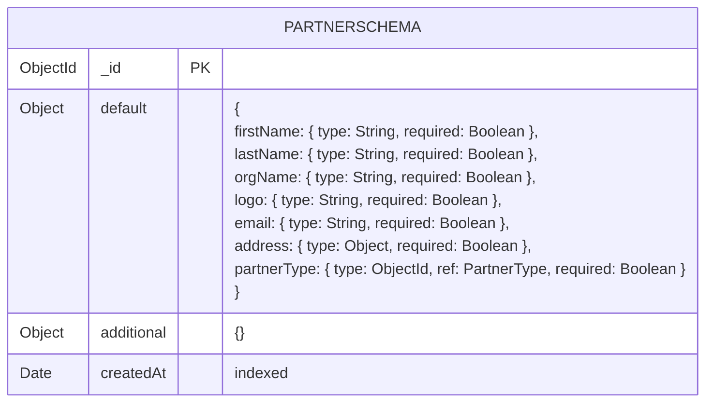
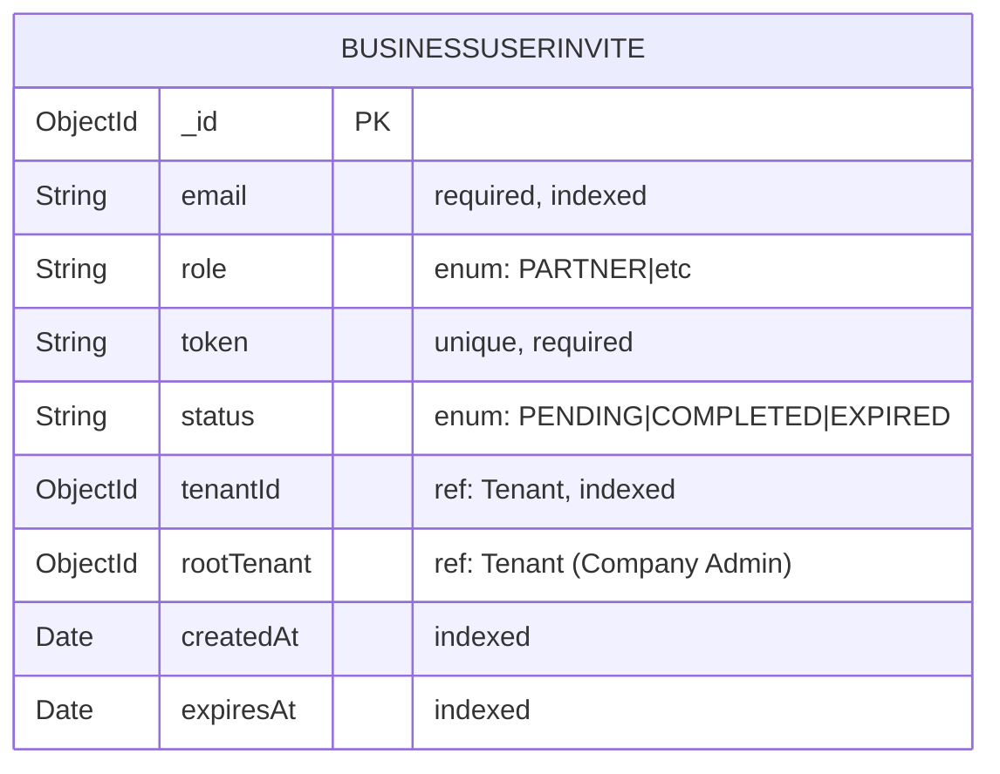
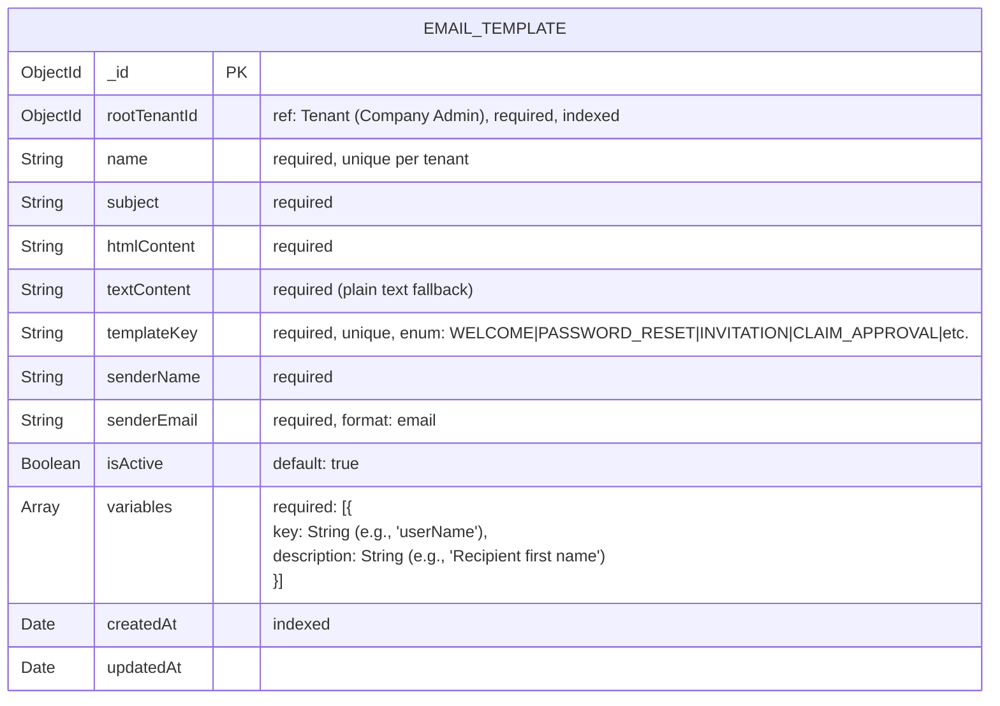
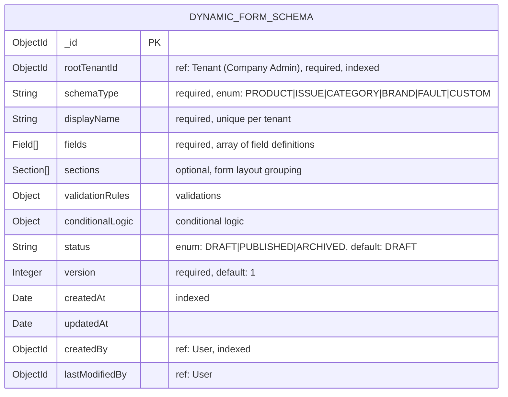

Here's a professionally refined version of your document with improved structure, consistency, and clarity:

---

# Warranty Management System Documentation

## Role Definitions
```ts
enum ROLES {
  ADMIN
  COMPANY_ADMIN
  PARTNER
  CONSUMER
}
```


## Field Definitions
```ts
interface Field {
  fieldId: String        // Unique identifier (e.g., "warranty_months")
  type: 'TEXT' | 'NUMBER' | 'SELECT' | 'CHECKBOX' | 'DATE' | 'FILE';
  label: String          // Display label
  placeholder?: String   // Optional hint text
  defaultValue?: Any     // Pre-filled value
  required: Boolean      // default: false
  options?: {            // For SELECT/RADIO types
    value: String
    label: String
  }[]
  validation?: {
    min?: Number         // For numbers/dates
    max?: Number
    pattern?: String     // Regex for text
    errorMessage?: String
  }
  ui?: {
    width?: String       // "50%", "full" etc.
    order?: Number       // Display sequence
    group?: String       // Section reference
  }
}
```

## Section Definition
```ts
interface Section {
  sectionId: String      // Unique identifier
  title: String          // Display header
  columns?: Number       // 1|2|3 column layout
  isCollapsible?: Boolean
  order: Number          // Display sequence
}
```


## Database Schema

### User Collection


### Settings Collection


## Administrative Privileges

### Admin Dashboard Functionality

#### Company Management
- View all registered companies
- Create/update company profiles and associated user records
- Company-specific operations:
  - **Company Details**: Full CRUD capabilities
  - **Warranty Templates**: Manage templates (CRUD)

#### Form Configuration
- Customizable form schemas:
  - Product : Dynamic Form Schema
  - Issue : Dynamic Form Schema
  - Categories : Dynamic Form Schema
  - Brands : Dynamic Form Schema
  - Fault : Dynamic Form Schema

#### Templates
- Customizable Templates
	- Email Templates

#### Partner Ecosystem
- **Partner Types**: Manage Partner (Dealer/Retailer/Repairer)
- **Personas**: Configure role-based profiles
- **Permissions**: Define access control for each role

---

## Database Collections

### Permissions Collection


### Tenant Collection


### PartnerType Collection


### PartnerSchema Collection


### BusinessUserInvite Collection


### EmailTemplate Collection



### Form Schema Collection
**We can not use any lib so priovde me the proper type to make a proper type of form schema so via frontend by drag and drop we create form schema and this schema can be defined by the super admin for the onboarded company**


Example Documentation 
```
{
  "rootTenantId": "65a1bc...",
  "schemaType": "PRODUCT",
  "displayName": "Electronics Product Form",
  "fields": [
    {
      "fieldId": "product_name",
      "type": "TEXT",
      "label": "Product Name",
      "required": true,
      "ui": { "order": 1, "group": "basic_info" }
    },
    {
      "fieldId": "warranty_months",
      "type": "NUMBER",
      "label": "Warranty Period",
	  "required": true,
      "validation": { "min": 0, "max": 60 },
      "ui": { "order": 2, "group": "basic_info" }
    }
  ],
  "sections": [
    {
      "sectionId": "basic_info",
      "title": "Basic Information",
      "columns": 2,
      "order": 1
    }
  ],
  "status": "PUBLISHED",
  "version": 3
}
```

