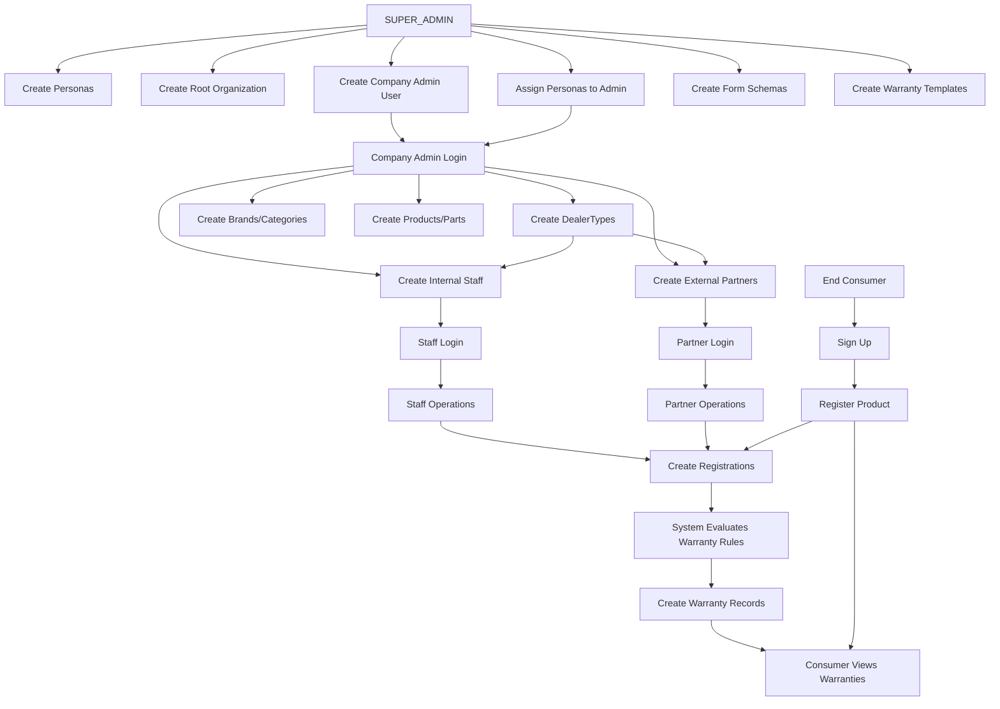

# Complete System Workflow - From SUPER_ADMIN to End Consumer

This document provides a comprehensive explanation of the complete workflow in the Warranty Management System, from initial system setup by SUPER_ADMIN to end consumer operations.

## Table of Contents

1. [System Architecture Overview](#system-architecture-overview)
2. [Phase 1: System Initialization (SUPER_ADMIN)](#phase-1-system-initialization-super_admin)
3. [Phase 2: Company Onboarding](#phase-2-company-onboarding)
4. [Phase 3: Persona & Permission System](#phase-3-persona--permission-system)
5. [Phase 4: Form Schema & Warranty Template Creation](#phase-4-form-schema--warranty-template-creation)
6. [Phase 5: Company Admin Setup](#phase-5-company-admin-setup)
7. [Phase 6: DealerType Creation](#phase-6-dealertype-creation)
8. [Phase 7: User & Partner Management](#phase-7-user--partner-management)
9. [Phase 8: Product & Part Management](#phase-8-product--part-management)
10. [Phase 9: Registration & Warranty Creation](#phase-9-registration--warranty-creation)
11. [Phase 10: Consumer Portal Operations](#phase-10-consumer-portal-operations)

---

## System Architecture Overview

### Core Models

The system is built on the following Prisma models:

1. **User** - System users (SUPER_ADMIN, Company Admins, Staff, Partners, Consumers)
2. **Organization** - Multi-tenant organizations with hierarchy (ROOT → BRANCH)
3. **UserAccess** - Links users to organizations with portal access (COMPANY/CONSUMER)
4. **Persona** - System-level permission definitions
5. **DealerPersona** - Links users to personas within organizations
6. **DealerType** - Company-defined partner categories (INTERNAL/EXTERNAL)
7. **FormSchema** - Dynamic form definitions (Product, Part, Brand, Category, Registration, Claim, etc.)
8. **FormData** - Form submissions (Product data, Part data, Registration data, etc.)
9. **WarrantyTemplate** - Warranty rule definitions with validation logic
10. **Warranty** - Actual warranty records created from registrations

### Key Relationships

```
Organization (ROOT)
  ├── UserAccess (COMPANY_SUPER_ADMIN)
  │   └── DealerPersona (Personas assigned)
  ├── Organization (BRANCH - External Partner)
  │   └── UserAccess (COMPANY_PARTNER)
  │       └── DealerPersona (from DealerType)
  ├── DealerType (INTERNAL/EXTERNAL)
  │   └── DealerPersona (personas linked to dealer type)
  ├── FormSchema (Product, Part, Brand, Category, Registration, Claim)
  │   ├── FormData (actual data)
  │   └── WarrantyTemplate
  └── Warranty (created from Registration FormData)
```

---

## Phase 1: System Initialization (SUPER_ADMIN)

### Step 1.1: Create Personas

**SUPER_ADMIN** creates system-level personas (permissions) that will be available to all organizations.

**Prisma Model**: `Persona`

```prisma
Persona {
  name: "Create Product"
  label: "Can Create Product"
  code: "CAN_CREATE_PRODUCT"
  description: "Allows user to create products"
  isActive: true
}
```

**Actions**:

- Create multiple personas (one per permission)
- Examples: `CAN_CREATE_PRODUCT`, `CAN_CREATE_BRAND`, `CAN_CREATE_CATEGORIES`, `CAN_CREATE_CLAIMS`, `CAN_UPDATE_CLAIMS`, `CAN_REGISTRATION`, `CAN_ADD_PARTS`
- Toggle `isActive` to enable/disable globally

**Database Records**:

- Multiple `Persona` records created
- Each represents a single, atomic permission

---

## Phase 2: Company Onboarding

### Step 2.1: Create Root Organization

**SUPER_ADMIN** creates a new company (root organization).

**Prisma Model**: `Organization`

```prisma
Organization {
  name: "Acme Corporation"
  slug: "acme-corp"
  companyName: "Acme Corporation"
  type: "ROOT"
  rootId: <self-reference>
  parentId: null
  enabledModules: { products: true, claims: true, registration: true }
  isActive: true
}
```

**Actions**:

- Create root organization
- Set company details (name, slug, contact info, address)
- Configure enabled modules (JSON)
- Set organization status

**Database Records**:

- One `Organization` record with `type = "ROOT"`

### Step 2.2: Assign Personas to Company Admin User

**SUPER_ADMIN** creates a company admin user and assigns personas directly.

**Prisma Models**: `User`, `UserAccess`, `DealerPersona`

```prisma
// 1. Create User
User {
  email: "admin@acme.com"
  firstName: "John"
  lastName: "Doe"
  fullName: "John Doe"
  adminPasswordHash: <hashed>
  adminEmailVerified: true
}

// 2. Create UserAccess (COMPANY portal)
UserAccess {
  userId: <user-id>
  orgId: <org-id>
  portalType: "COMPANY"
  role: "COMPANY_SUPER_ADMIN"
  dealerTypeId: null  // Direct assignment, no dealer type
  partnerType: null
  passwordHash: <hashed>
  emailVerified: true
}

// 3. Create DealerPersona records (direct assignment)
DealerPersona {
  userId: <user-id>
  orgId: <org-id>
  personaId: <CAN_CREATE_PRODUCT-persona-id>
  dealerTypeId: null  // Direct assignment
  isActive: true
  assignedBy: "SUPER_ADMIN"
  assignedById: <super-admin-user-id>
}
// Repeat for each persona assigned
```

**Actions**:

- Create user account
- Create UserAccess for COMPANY portal
- Create DealerPersona records for each permission assigned
- Set `dealerTypeId = null` (direct assignment, not via dealer type)

**Database Records**:

- One `User` record
- One `UserAccess` record (portalType: "COMPANY", role: "COMPANY_SUPER_ADMIN")
- Multiple `DealerPersona` records (one per assigned persona)

---

## Phase 3: Persona & Permission System

### Step 3.1: Permission Resolution

When a user logs in, the system resolves their permissions:

**Process**:

1. Get user's `DealerPersona` records (where `isActive = true`)
2. Extract persona IDs
3. Get persona codes from `Persona` table
4. Final permissions = List of persona codes

**Example**:

- User has `DealerPersona` records: [CAN_CREATE_PRODUCT, CAN_CREATE_BRAND]
- System resolves to: ["CAN_CREATE_PRODUCT", "CAN_CREATE_BRAND"]
- UI shows only features user has permission for

**Note**: In the simplified model (without OrganizationPersona), permissions are directly resolved from DealerPersona. The organization context is maintained via `orgId` in DealerPersona.

---

## Phase 4: Form Schema & Warranty Template Creation

### Step 4.1: Create Form Schemas

**SUPER_ADMIN** creates form schemas for the company.

**Prisma Model**: `FormSchema`

```prisma
// Product Form Schema
FormSchema {
  orgId: <org-id>
  type: "PRODUCT"
  name: "Product Schema"
  schema: {
    fields: [
      { name: "productName", type: "text", required: true },
      { name: "modelNumber", type: "text", required: true },
      { name: "serialNumber", type: "text" },
      { name: "categoryIds", type: "array", items: "string" },
      { name: "warrantyTemplateIds", type: "array", items: "string" },
      { name: "partIds", type: "array", items: "string" }
    ]
  }
  linkedBrandSchemaId: <brand-schema-id>
  linkedCategorySchemaId: <category-schema-id>
  isActive: true
  isPublished: true
}

// Part Form Schema
FormSchema {
  orgId: <org-id>
  type: "PART"
  name: "Part Schema"
  parentProductSchemaId: <product-schema-id>
  linkedBrandSchemaId: <brand-schema-id>
  linkedCategorySchemaId: <category-schema-id>
  schema: {
    fields: [
      { name: "partName", type: "text", required: true },
      { name: "partType", type: "text", required: true },
      { name: "serialNumber", type: "text" },
      { name: "categoryIds", type: "array", items: "string" },
      { name: "warrantyTemplateIds", type: "array", items: "string" }
    ]
  }
  isActive: true
  isPublished: true
}

// Brand Form Schema
FormSchema {
  orgId: <org-id>
  type: "BRAND"
  name: "Brand Schema"
  schema: {
    fields: [
      { name: "brandName", type: "text", required: true },
      { name: "logo", type: "image" }
    ]
  }
  isActive: true
  isPublished: true
}

// Category Form Schema
FormSchema {
  orgId: <org-id>
  type: "CATEGORY"
  name: "Category Schema"
  schema: {
    fields: [
      { name: "categoryName", type: "text", required: true },
      { name: "description", type: "text" }
    ]
  }
  isActive: true
  isPublished: true
}

// Registration Form Schema
FormSchema {
  orgId: <org-id>
  type: "REGISTRATION"
  name: "Registration Schema"
  schema: {
    fields: [
      { name: "purchaseDate", type: "date", required: true },
      { name: "purchasePrice", type: "number" },
      { name: "warrantyIds", type: "array", items: "string" }
    ]
  }
  isActive: true
  isPublished: true
}
```

**Actions**:

- Create schemas for: Product, Part, Brand, Category, Registration, Claim, Fault, Issue
- Link Product schema to Brand and Category schemas
- Link Part schema to Brand, Category, and parent Product schema
- Publish schemas (`isPublished = true`)

**Database Records**:

- Multiple `FormSchema` records (one per form type)

### Step 4.2: Create Warranty Templates

**SUPER_ADMIN** creates warranty templates with validation rules.

**Prisma Model**: `WarrantyTemplate`

```prisma
WarrantyTemplate {
  orgId: <org-id>
  formSchemaId: <product-schema-id>  // or part-schema-id
  name: "Standard Warranty"
  warrantyType: "STANDARD"
  warrantyPeriod: { value: 12, unit: "MONTHS" }
  rules: {
    logic: "AND",
    conditions: [
      {
        left: "registration.purchaseDate",
        op: "GTE",
        right: { value: -30, unit: "DAYS" }  // Within 30 days
      },
      {
        left: "product.productCategory",
        op: "EQ",
        right: "Electronics"
      }
    ]
  }
  coverageDetails: [
    {
      type: "BULLET_POINTS",
      title: "Coverage Includes",
      items: ["Manufacturing defects", "Material defects"]
    }
  ]
  info: [...]
  terms: [...]
  isActive: true
}
```

**Actions**:

- Create warranty templates for products and parts
- Define validation rules (JSON structure)
- Set warranty periods (with units: DAYS, MONTHS, YEARS, KILOMETERS, etc.)
- Configure coverage details, info, and terms

**Database Records**:

- Multiple `WarrantyTemplate` records (one per template)

---

## Phase 5: Company Admin Setup

### Step 5.1: Company Admin Login

**Company Admin User** logs into the COMPANY portal.

**Process**:

1. User authenticates via `UserAccess` (portalType: "COMPANY")
2. System resolves permissions from `DealerPersona` records
3. UI shows only features user has permission for

**Access**:

- Company Admin can see all enabled modules
- Can create products, brands, categories
- Can manage users and partners
- Can create DealerTypes

---

## Phase 6: DealerType Creation

### Step 6.1: Create DealerType

**Company Admin User** creates DealerTypes for internal staff and external partners.

**Prisma Model**: `DealerType`

```prisma
// Internal DealerType (for COMPANY_STAFF)
DealerType {
  orgId: <org-id>
  name: "SupportAgent"
  description: "Support staff with limited permissions"
  partnerType: "INTERNAL"
  isActive: true
  isDefault: false
}

// External DealerType (for COMPANY_PARTNER)
DealerType {
  orgId: <org-id>
  name: "Dealer"
  description: "External dealer partner"
  partnerType: "EXTERNAL"
  isActive: true
  isDefault: false
}
```

**Actions**:

- Create DealerType with name and description
- Set `partnerType` (INTERNAL or EXTERNAL)
- Activate DealerType

**Database Records**:

- `DealerType` record created

**Note**: In the simplified model, personas are assigned directly to users via DealerPersona. The DealerType serves as a category/organizational unit, but persona assignment happens when users are created (see Phase 7).

---

## Phase 7: User & Partner Management

### Step 7.1: Create Internal Staff (COMPANY_STAFF)

**Company Admin User** creates internal staff members.

**Prisma Models**: `User`, `UserAccess`, `DealerPersona`

```prisma
// 1. Create User
User {
  email: "staff@acme.com"
  firstName: "Alice"
  lastName: "Smith"
  fullName: "Alice Smith"
}

// 2. Create UserAccess (same organization, INTERNAL)
UserAccess {
  userId: <user-id>
  orgId: <same-org-id>  // Same organization
  portalType: "COMPANY"
  role: "COMPANY_STAFF"
  dealerTypeId: <support-agent-dealer-type-id>
  partnerType: "INTERNAL"
  passwordHash: <hashed>
  emailVerified: false  // Invitation sent
}

// 3. Create DealerPersona records (assign personas)
DealerPersona {
  userId: <user-id>
  orgId: <org-id>
  personaId: <CAN_VIEW_CLAIMS-persona-id>
  dealerTypeId: <support-agent-dealer-type-id>
  isActive: true
  assignedBy: "COMPANY_SUPER_ADMIN"
  assignedById: <company-admin-user-id>
}
// Repeat for each persona assigned to this DealerType
```

**Actions**:

- Create user account
- Create UserAccess (same org, role: COMPANY_STAFF, partnerType: INTERNAL)
- Assign DealerType
- Create DealerPersona records for personas assigned to this DealerType
- Send invitation email

**Database Records**:

- One `User` record
- One `UserAccess` record (role: COMPANY_STAFF, partnerType: INTERNAL)
- Multiple `DealerPersona` records (linked to DealerType)

### Step 7.2: Create External Partner (COMPANY_PARTNER)

**Company Admin User** creates external partner (creates new branch organization).

**Prisma Models**: `Organization`, `User`, `UserAccess`, `DealerPersona`

```prisma
// 1. Create Branch Organization
Organization {
  name: "Best Buy Store"
  slug: "best-buy-store"
  companyName: "Best Buy Store"
  type: "BRANCH"
  rootId: <root-org-id>
  parentId: <parent-org-id>
  enabledModules: <inherited from parent>
  isActive: true
}

// 2. Create User
User {
  email: "partner@bestbuy.com"
  firstName: "Bob"
  lastName: "Johnson"
  fullName: "Bob Johnson"
}

// 3. Create UserAccess (new branch organization, EXTERNAL)
UserAccess {
  userId: <user-id>
  orgId: <branch-org-id>  // New branch organization
  portalType: "COMPANY"
  role: "COMPANY_PARTNER"
  dealerTypeId: <dealer-dealer-type-id>
  partnerType: "EXTERNAL"
  passwordHash: <hashed>
  emailVerified: false
}

// 4. Create DealerPersona records
DealerPersona {
  userId: <user-id>
  orgId: <branch-org-id>
  personaId: <CAN_CREATE_REGISTRATION-persona-id>
  dealerTypeId: <dealer-dealer-type-id>
  isActive: true
  assignedBy: "COMPANY_SUPER_ADMIN"
  assignedById: <company-admin-user-id>
}
// Repeat for each persona
```

**Actions**:

- Create branch organization (type: BRANCH)
- Create user account
- Create UserAccess (new branch org, role: COMPANY_PARTNER, partnerType: EXTERNAL)
- Assign DealerType
- Create DealerPersona records
- Send invitation email

**Database Records**:

- One `Organization` record (type: BRANCH)
- One `User` record
- One `UserAccess` record (role: COMPANY_PARTNER, partnerType: EXTERNAL)
- Multiple `DealerPersona` records

---

## Phase 8: Product & Part Management

### Step 8.1: Create Brand

**Company Admin User** creates a brand.

**Prisma Models**: `FormSchema`, `FormData`

```prisma
// Get Brand FormSchema
FormSchema {
  type: "BRAND"
  orgId: <org-id>
}

// Create Brand FormData
FormData {
  orgId: <org-id>
  formSchemaId: <brand-schema-id>
  formType: "BRAND"
  data: {
    brandName: "Samsung",
    logo: "https://..."
  }
  status: "ACTIVE"
  createdBy: <user-id>
}
```

**Actions**:

- Fetch Brand FormSchema for organization
- Create FormData with brand information
- Set status to ACTIVE

**Database Records**:

- One `FormData` record (formType: "BRAND")

### Step 8.2: Create Category

**Company Admin User** creates a category.

```prisma
FormData {
  orgId: <org-id>
  formSchemaId: <category-schema-id>
  formType: "CATEGORY"
  data: {
    categoryName: "Electronics",
    description: "Electronic products"
  }
  status: "ACTIVE"
}
```

**Database Records**:

- One `FormData` record (formType: "CATEGORY")

### Step 8.3: Create Part

**Company Admin User** creates a part (optional - products can exist without parts).

```prisma
FormData {
  orgId: <org-id>
  formSchemaId: <part-schema-id>
  formType: "PART"
  brandFormDataId: <brand-form-data-id>
  data: {
    partName: "Compressor",
    partType: "Motor",
    serialNumber: "CPR-001",
    categoryIds: [<category-id-1>, <category-id-2>],
    warrantyTemplateIds: [<warranty-template-id>]
  }
  status: "ACTIVE"
}
```

**Database Records**:

- One `FormData` record (formType: "PART")
- Link to Brand via `brandFormDataId`
- Categories stored in `data.categoryIds` array

### Step 8.4: Create Product

**Company Admin User** creates a product.

```prisma
FormData {
  orgId: <org-id>
  formSchemaId: <product-schema-id>
  formType: "PRODUCT"
  brandFormDataId: <brand-form-data-id>
  data: {
    productName: "Refrigerator Model X",
    modelNumber: "RFG-X-2024",
    serialNumber: "RFG-001",
    categoryIds: [<category-id-1>, <category-id-2>],
    warrantyTemplateIds: [<warranty-template-id-1>, <warranty-template-id-2>],
    partIds: [<part-id-1>, <part-id-2>]  // Optional - products can have parts
  }
  status: "ACTIVE"
}
```

**Actions**:

- Fetch Product FormSchema
- Fetch available brands, categories, warranty templates, parts from FormData
- Create FormData with product information
- Link to Brand via `brandFormDataId`
- Store category IDs in `data.categoryIds` array
- Store warranty template IDs in `data.warrantyTemplateIds` array
- Store part IDs in `data.partIds` array (if product has parts)

**Database Records**:

- One `FormData` record (formType: "PRODUCT")
- Link to Brand via `brandFormDataId`
- Parts linked via `parentProductDataId` in Part FormData (if parts exist)

---

## Phase 9: Registration & Warranty Creation

### Step 9.1: Consumer Registration

**End Consumer** or **Company User** registers a product.

**Prisma Models**: `FormData`, `Warranty`

```prisma
// 1. Create Registration FormData
FormData {
  orgId: <org-id>
  formSchemaId: <registration-schema-id>
  formType: "REGISTRATION"
  registeredProductId: <product-form-data-id>
  data: {
    purchaseDate: "2024-01-15",
    purchasePrice: 1500.00,
    warrantyIds: []  // Will be populated after warranty creation
  }
  status: "ACTIVE"
  createdBy: <user-id>  // Consumer user ID or company user ID
}

// 2. Warranty Evaluation Process
// System retrieves:
// - Product FormData
// - Part FormData (if product has parts)
// - Warranty Templates (from product and parts)
// - Brand and Category data

// 3. For each WarrantyTemplate, evaluate rules:
// - Build evaluation context: { registration, product, parts[], brand, categories[] }
// - Evaluate rules JSON against context
// - Determine if warranty is applicable

// 4. Create Warranty records
Warranty {
  registrationFormDataId: <registration-form-data-id>
  warrantyTemplateId: <warranty-template-id>
  productFormDataId: <product-form-data-id>
  partFormDataId: <part-form-data-id>  // Optional - only if warranty is for specific part
  isApplicable: true  // Based on rule evaluation
  partsCoverage: { ... }  // If part warranty
  templateSnapshot: {
    // Copy of WarrantyTemplate at creation time
    name: "Standard Warranty",
    warrantyType: "STANDARD",
    warrantyPeriod: { value: 12, unit: "MONTHS" },
    rules: { ... },
    coverageDetails: [ ... ],
    info: [ ... ],
    terms: [ ... ]
  }
  coverageStatus: "FULL_COVERAGE"
  warrantyStartDate: "2024-01-15"
  warrantyEndDate: "2025-01-15"  // Calculated from warrantyPeriod
  validationDetails: {
    rulesPassed: [...],
    rulesFailed: [...]
  }
  status: "ACTIVE"
}

// 5. Update Registration FormData with warranty IDs
FormData {
  data: {
    ...
    warrantyIds: [<warranty-id-1>, <warranty-id-2>, ...]
  }
}
```

**Actions**:

1. Create Registration FormData
2. System retrieves product and parts
3. System retrieves warranty templates (from product and parts)
4. For each template, evaluate rules against registration/product/part data
5. Create Warranty records for applicable templates
6. Update Registration FormData with warranty IDs

**Database Records**:

- One `FormData` record (formType: "REGISTRATION")
- Multiple `Warranty` records (one per applicable warranty template)

### Step 9.2: Warranty Rule Evaluation

**System Process** (automated during registration):

**Evaluation Context**:

```json
{
  "registration": {
    "purchaseDate": "2024-01-15",
    "purchasePrice": 1500.0
  },
  "product": {
    "productName": "Refrigerator Model X",
    "modelNumber": "RFG-X-2024",
    "categoryIds": ["electronics", "appliances"]
  },
  "parts": [
    {
      "partName": "Compressor",
      "partType": "Motor",
      "serialNumber": "CPR-001"
    }
  ],
  "brand": {
    "brandName": "Samsung"
  },
  "categories": [
    { "categoryName": "Electronics" },
    { "categoryName": "Appliances" }
  ]
}
```

**Rule Evaluation**:

- Parse rules JSON structure
- Evaluate each condition against context
- Apply logic operators (AND/OR)
- Determine if warranty is applicable

**Result**:

- `isApplicable: true/false`
- `validationDetails` with passed/failed rules
- `warrantyStartDate` and `warrantyEndDate` calculated

---

## Phase 10: Consumer Portal Operations

### Step 10.1: Consumer Registration

**End Consumer** creates account and registers product.

**Prisma Models**: `User`, `UserAccess`

```prisma
// 1. Create Consumer User
User {
  email: "consumer@example.com"
  firstName: "Jane"
  lastName: "Doe"
  fullName: "Jane Doe"
}

// 2. Create UserAccess (CONSUMER portal)
UserAccess {
  userId: <user-id>
  orgId: <org-id>
  portalType: "CONSUMER"
  role: null  // No role for consumers
  dealerTypeId: null
  partnerType: null
  passwordHash: <hashed>
  emailVerified: true
}
```

**Actions**:

- Consumer signs up
- Create User account
- Create UserAccess (portalType: "CONSUMER")
- Consumer can now register products

**Database Records**:

- One `User` record
- One `UserAccess` record (portalType: "CONSUMER")

### Step 10.2: Consumer Views Warranties

**End Consumer** views their registered products and warranties.

**Process**:

1. Consumer logs into CONSUMER portal
2. System queries `FormData` where:
   - `formType = "REGISTRATION"`
   - `createdBy = <consumer-user-id>`
3. For each registration, get `Warranty` records from `data.warrantyIds`
4. Display warranties with:
   - Coverage status
   - Warranty period
   - Coverage details (from `templateSnapshot`)
   - Start/end dates

**Data Retrieved**:

- Registration FormData
- Warranty records (from warranty IDs in registration data)
- Product FormData (from `registeredProductId`)
- Warranty details from `templateSnapshot`

---

## Complete Workflow Diagram



---

## Key Database Relationships Summary

### User → Organization

- **UserAccess**: Links user to organization with portal access
- **DealerPersona**: Links user to personas (permissions) within organization

### Organization Hierarchy

- **Organization**: Self-referential (parent → children, root → branches)
- **UserAccess**: Users belong to specific organizations

### Form System

- **FormSchema**: Defines form structure (one per type per organization)
- **FormData**: Stores form submissions (products, parts, registrations, etc.)
- **FormData**: Self-referential (product → parts, registration → product)

### Warranty System

- **WarrantyTemplate**: Defines warranty rules (linked to FormSchema)
- **Warranty**: Actual warranty records (created from registration)
- **Warranty**: Links to registration, product, part, and template

### Permission System

- **Persona**: System-level permission definitions
- **DealerPersona**: User permissions within organizations
- **DealerType**: Organizational categories (INTERNAL/EXTERNAL)

---

## Summary

This workflow covers the complete journey from system initialization by SUPER_ADMIN to end consumer operations:

1. **SUPER_ADMIN** sets up personas, organizations, form schemas, and warranty templates
2. **Company Admin** manages users, partners, products, and operations
3. **Staff/Partners** perform day-to-day operations (registrations, claims)
4. **End Consumers** register products and view warranties

The system uses a multi-tenant architecture with:

- **Organizations** for tenant isolation
- **FormSchema/FormData** for dynamic form management
- **WarrantyTemplate/Warranty** for warranty management
- **Persona/DealerPersona** for permission management
- **DealerType** for organizational categorization

All operations are scoped to organizations, ensuring proper multi-tenancy and data isolation.
