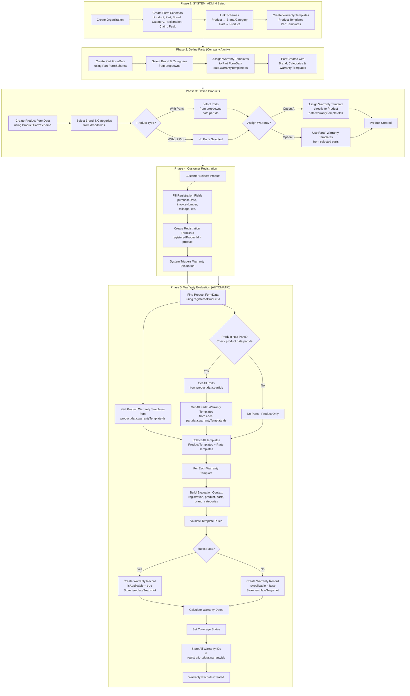
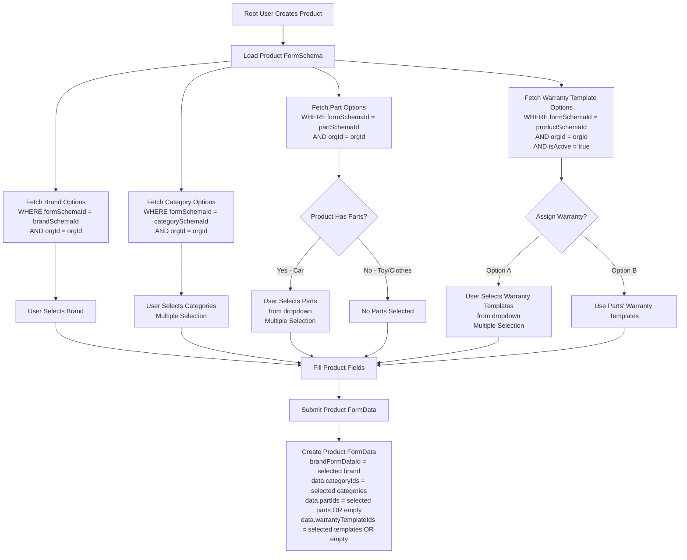
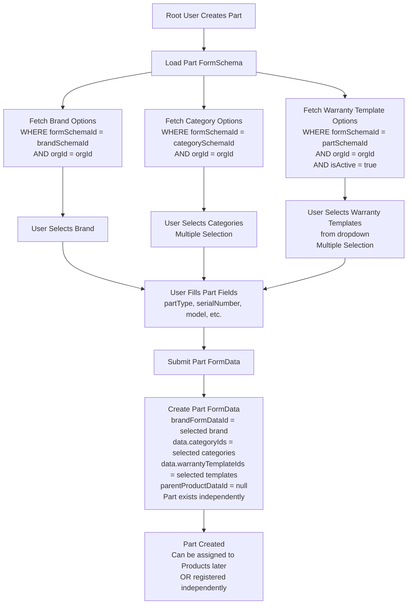
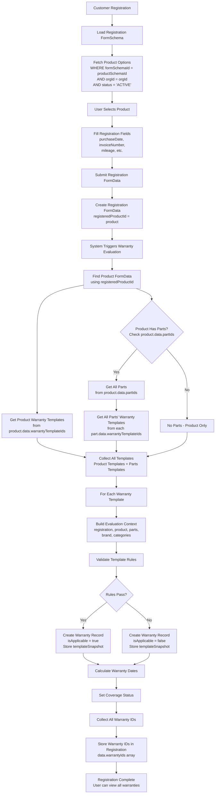
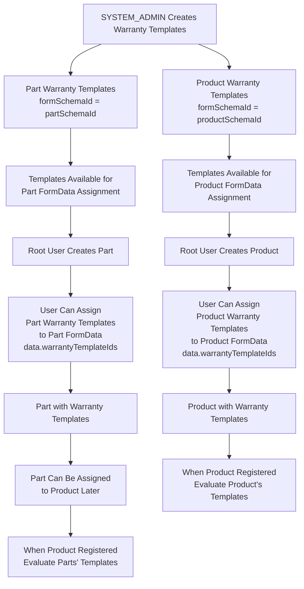

# Dynamic Form Schema System - Complete Design Document

## Table of Contents

1. [Overview](#overview)
2. [Workflow](#workflow)
3. [Core Principles](#core-principles)
4. [Schema Models](#schema-models)
5. [System Flows](#system-flows)
6. [Design Decisions](#design-decisions)

---

## Overview

This document defines the complete Prisma schema design for a dynamic form system that supports:

- **Single `FormSchema` table** for all form types (Product, Part, Brand, Category, Registration, Claim, Fault, etc.)
- **Single `FormData` table** for all form submissions
- **Product-Part hierarchical structure** (products can have parts, or products without parts)
- **Warranty template system** with rule-based validation
- **Warranty template assignments** at FormData level (products and parts can have warranty templates assigned)
- **Registration and claim workflows** with automatic warranty evaluation

### Key Requirements Fulfilled

✅ **Requirement 1**: Single FormSchema table manages ALL form types  
✅ **Requirement 2**: Single FormData table stores ALL form submissions  
✅ **Requirement 3**: Products can have parts (cars) or no parts (toys, clothes)  
✅ **Requirement 4**: Warranty templates can be assigned to both Product FormData and Part FormData  
✅ **Requirement 5**: Brand/Category schemas link to both Product and Part schemas  
✅ **Requirement 6**: Registration evaluates warranties from product and its parts  
✅ **Requirement 7**: Registration can select specific parts during registration  
✅ **Requirement 8**: Parts can be registered independently (not just through product registration)  
✅ **Requirement 9**: Supports Company A (product + parts) and Company B (products only)

---

## Workflow

### Step-by-Step Workflow

**Phase 1: SYSTEM_ADMIN Setup (One-time per company)**

1. SYSTEM_ADMIN creates Form Schemas for root company:
   - Product FormSchema
   - Part FormSchema
   - Brand FormSchema
   - Category FormSchema
   - Registration FormSchema
   - Claim FormSchema
   - Fault FormSchema
2. SYSTEM_ADMIN creates Warranty Templates:
   - Product Warranty Templates (linked to Product FormSchema)
   - Part Warranty Templates (linked to Part FormSchema)

**Phase 2: Root Company Defines Parts (Company A only - if parts are needed)**

1. Root Company user uses Part FormSchema to create Part FormData entries
2. User selects Brand and Categories from dropdowns (parts also have brand/category)
3. For each Part FormData, user can assign Warranty Templates
4. Parts are stored independently (not yet linked to products)

**Phase 3: Root Company Defines Products**

1. Root Company user uses Product FormSchema to create Product FormData
2. User selects Brand and Categories from dropdowns
3. User can assign Parts to Product (optional - products can be without parts)
4. User can assign Warranty Templates directly to Product (optional)
5. Product FormData stores:
   - Brand reference (foreign key)
   - Category references (array in JSON)
   - Warranty Template assignments (array of template IDs in JSON)
   - Part assignments (array of part FormData IDs in JSON)

**Phase 4: Customer Registration (Product Registration)**

**Registration Flow:**

1. Customer selects Product from dropdown
2. Customer fills registration fields (purchaseDate, invoiceNumber, mileage, etc.)
3. System creates Registration FormData with `registeredProductId`
4. System automatically processes warranty evaluation:
   - **Step 1**: Find Product FormData using `registeredProductId`
   - **Step 2**: Check if Product has Parts (check `product.data.partIds` array)
   - **Step 3**: Get Product's Warranty Templates (from `product.data.warrantyTemplateIds`)
   - **Step 4**: If Parts exist, get all Parts' Warranty Templates (from each `part.data.warrantyTemplateIds`)
   - **Step 5**: Collect all Warranty Templates (Product + Parts if exist)
   - **Step 6**: For each Warranty Template, validate against registration data
   - **Step 7**: Create Warranty records with status (isApplicable: true/false)
   - **Step 8**: Store all created Warranty IDs in Registration FormData (`data.warrantyIds` array)
5. When user views registration, system retrieves all warranties using `data.warrantyIds` to show:
   - All warranty records (product + parts)
   - Warranty status (applicable or not)
   - Coverage details for each warranty

---

## Company Types

The system supports two different company configurations:

### Company A: Product + Parts

- **Requires**: Product FormSchema, Part FormSchema, Brand FormSchema, Category FormSchema
- **Workflow**:
  1. Define Parts with Brand, Categories, and Warranty Templates
  2. Define Products with Brand, Categories, Parts (optional), and Warranty Templates
  3. Registration can be:
     - Product Registration (with optional part selection)
     - Part Registration (independent part registration)
- **Use Cases**: Cars, Electronics, Machinery (products with components)

### Company B: Products Only

- **Requires**: Product FormSchema, Brand FormSchema, Category FormSchema
- **Workflow**:
  1. Define Products with Brand, Categories, and Warranty Templates (no parts)
  2. Registration is Product Registration only
- **Use Cases**: Toys, Clothes, Simple Products (no components)

**Note**: The same schema structure supports both company types. Company B simply doesn't use the Part FormSchema or create Part FormData entries.

---

## Core Principles

1. **Single Table Pattern**: One schema table, one data table for all form types
2. **Type-Based Differentiation**: Form types distinguished by `type` field
3. **One Schema Per Type Per Company**: Each company has ONE schema per form type
4. **JSON Flexibility**: Schema definitions and data stored as JSON for maximum flexibility
5. **Warranty Template Assignment at FormData Level**: Warranty templates are assigned to Product FormData and Part FormData, not just schemas
6. **Flexible Product Structure**: Products can have parts (cars) or no parts (toys, clothes)
7. **Product Registration Only**: Registration is always for a product (not for parts independently)
8. **Parts Have Brand/Category**: Parts also connect with brand and category (similar to products)
9. **Warranty IDs in Registration**: Registration FormData stores all created Warranty IDs in `data.warrantyIds` array for easy retrieval
10. **Company Type Flexibility**: Supports Company A (product + parts) and Company B (products only)

---

## Schema Models

### 1. FormSchema

**Purpose**: Defines the structure of all forms in the system (Product, Part, Brand, Category, Registration, Claim, Fault, etc.)

**Important**: Each company has **ONE FormSchema per type**. All FormData entries for that company reference the same FormSchema for that type.

```prisma
model FormSchema {
  // Primary ID
  id                      String    @id @default(dbgenerated("gen_random_uuid()")) @db.Uuid

  // Organization (tenant isolation)
  orgId                   String    @db.Uuid

  // Form Type: "PRODUCT", "PART", "BRAND", "CATEGORY", "REGISTRATION", "CLAIM", "FAULT", "ISSUE", etc.
  type                    String    @db.String

  // Form Name
  name                    String    @db.String
  description             String?   @db.String

  // Version control
  version                 Int       @default(1)
  isActive                Boolean   @default(true)
  isPublished             Boolean   @default(false)

  // Schema Definition (JSON structure defining form fields)
  schema                  Json      @db.JsonB

  // Metadata (additional config, UI hints, validation rules, etc.)
  metadata                Json?     @db.JsonB

  // Relationships
  // For Product schemas: links to Brand and Category schemas
  // For Part schemas: also links to Brand and Category schemas (parts have brand/category too)
  linkedBrandSchemaId     String?   @db.Uuid
  linkedCategorySchemaId   String?   @db.Uuid

  // For Part schemas: links to parent Product schema (optional - parts can exist independently)
  parentProductSchemaId   String?   @db.Uuid

  // Timestamps
  createdAt               DateTime  @default(now()) @db.Timestamptz
  updatedAt               DateTime  @updatedAt @db.Timestamptz
  publishedAt             DateTime? @db.Timestamptz

  // Soft Delete
  deletedAt               DateTime? @db.Timestamptz
  deletedBy               String?   @db.String

  // Relationships
  organization            Organization  @relation(fields: [orgId], references: [id], onDelete: Cascade)

  // Self-referential for schema linking
  linkedBrandSchema       FormSchema?   @relation("BrandToProduct", fields: [linkedBrandSchemaId], references: [id], onDelete: SetNull)
  linkedCategorySchema    FormSchema?   @relation("CategoryToProduct", fields: [linkedCategorySchemaId], references: [id], onDelete: SetNull)
  parentProductSchema     FormSchema?   @relation("PartToProduct", fields: [parentProductSchemaId], references: [id], onDelete: SetNull)

  // Reverse relations
  productSchemasWithBrand FormSchema[]  @relation("BrandToProduct")
  productSchemasWithCategory FormSchema[] @relation("CategoryToProduct")
  partSchemas             FormSchema[]  @relation("PartToProduct")

  // Data and templates
  formData                FormData[]
  warrantyTemplates       WarrantyTemplate[]

  // Indexes
  @@index([orgId])
  @@index([type])
  @@index([isActive])
  @@index([isPublished])
  @@index([parentProductSchemaId])
  @@index([linkedBrandSchemaId])
  @@index([linkedCategorySchemaId])
  @@unique([orgId, type, name, version], name: "unique_schema_version")
}
```

---

### 2. FormData

**Purpose**: Stores all form submissions (products, parts, brands, categories, registrations, claims, etc.)

**Key Design**:

- Product FormData can have warranty templates assigned (stored in `data.warrantyTemplateIds`)
- Product FormData can have parts assigned (stored in `data.partIds`)
- Part FormData can have warranty templates assigned (stored in `data.warrantyTemplateIds`)
- Part FormData can have brand and categories (similar to products)
- Registration FormData registers a Product (via `registeredProductId`)
- Registration FormData stores all created Warranty IDs (stored in `data.warrantyIds` array)
- When viewing registration, system uses `data.warrantyIds` to retrieve all warranty records

```prisma
model FormData {
  // Primary ID
  id                      String    @id @default(dbgenerated("gen_random_uuid()")) @db.Uuid

  // Organization (tenant isolation)
  orgId                   String    @db.Uuid

  // Reference to the schema this data conforms to
  formSchemaId            String    @db.Uuid

  // Form Type (denormalized from FormSchema for query performance)
  formType                String    @db.String  // "PRODUCT", "PART", "BRAND", "REGISTRATION", etc.

  // Actual form data (JSON structure matching the schema)
  // For Product FormData: also stores warrantyTemplateIds and partIds arrays
  // For Part FormData: also stores warrantyTemplateIds array
  // For Registration FormData: also stores selectedPartIds array
  data                    Json      @db.JsonB

  // Status
  status                  String    @default("DRAFT") @db.String  // "DRAFT", "ACTIVE", "ARCHIVED", etc.

  // Relationships for Product-Part structure
  // If this is a Part FormData, link to parent Product FormData (optional - parts can exist independently)
  parentProductDataId     String?   @db.Uuid

  // If this is a Registration FormData, link to Product FormData
  registeredProductId     String?   @db.Uuid

  // For Product FormData: explicit link to Brand FormData (one brand per product)
  // For Part FormData: explicit link to Brand FormData (one brand per part)
  brandFormDataId         String?   @db.Uuid

  // Note: Categories are stored as array in data.categoryIds (for both Product and Part FormData)
  // Note: Warranty Templates assigned to Product are stored in data.warrantyTemplateIds
  // Note: Parts assigned to Product are stored in data.partIds
  // Note: Warranty Templates assigned to Part are stored in data.warrantyTemplateIds
  // Note: Registration FormData stores all created Warranty IDs in data.warrantyIds array

  // Creator/Updater tracking
  createdBy               String?   @db.Uuid
  updatedBy               String?   @db.Uuid

  // Timestamps
  createdAt               DateTime  @default(now()) @db.Timestamptz
  updatedAt               DateTime  @updatedAt @db.Timestamptz

  // Soft Delete
  deletedAt               DateTime? @db.Timestamptz
  deletedBy               String?   @db.String

  // Relationships
  organization            Organization  @relation(fields: [orgId], references: [id], onDelete: Cascade)
  formSchema              FormSchema    @relation(fields: [formSchemaId], references: [id], onDelete: Restrict)

  // Self-referential for Product-Part hierarchy (optional - parts can exist independently)
  parentProductData       FormData?     @relation("ProductToPart", fields: [parentProductDataId], references: [id], onDelete: Cascade)
  partData                FormData[]    @relation("ProductToPart")

  // Registration links
  registeredProduct       FormData?     @relation("RegistrationToProduct", fields: [registeredProductId], references: [id], onDelete: Restrict)
  registrations           FormData[]    @relation("RegistrationToProduct")

  // Brand link (for Product and Part FormData) - one brand per product/part
  brandFormData           FormData?     @relation("ProductToBrand", fields: [brandFormDataId], references: [id], onDelete: SetNull)

  // Reverse relations
  productsWithBrand        FormData[]    @relation("ProductToBrand")
  partsWithBrand           FormData[]    @relation("ProductToBrand")

  // Creator/Updater
  creator                 User?         @relation("FormDataCreator", fields: [createdBy], references: [id], onDelete: SetNull)
  updater                 User?         @relation("FormDataUpdater", fields: [updatedBy], references: [id], onDelete: SetNull)

  // Warranty records
  warranties              Warranty[]
  productWarranties       Warranty[]  @relation("WarrantyToProduct")

  // Indexes
  @@index([orgId])
  @@index([formSchemaId])
  @@index([formType])
  @@index([status])
  @@index([parentProductDataId])
  @@index([registeredProductId])
  @@index([brandFormDataId])
  @@index([createdBy])
  @@index([createdAt])
}
```

**FormData.data JSON Structure Examples:**

**Product FormData:**

```json
{
  "productName": "Toy Car Model X",
  "serialNumber": "TC-12345",
  "price": 50,
  "categoryIds": ["cat-id-1", "cat-id-2"],
  "warrantyTemplateIds": ["warranty-template-id-1"],
  "partIds": ["part-id-1", "part-id-2"]
}
```

**Part FormData:**

```json
{
  "partType": "ENGINE",
  "serialNumber": "ENG-67890",
  "model": "ENG-X1",
  "categoryIds": ["cat-id-3", "cat-id-4"],
  "warrantyTemplateIds": ["warranty-template-id-2"]
}
```

**Registration FormData:**

```json
{
  "purchaseDate": "2025-01-15",
  "invoiceNumber": "INV-001",
  "mileage": 0,
  "warrantyIds": ["warranty-id-1", "warranty-id-2", "warranty-id-3"]
}
```

**Note**: The `warrantyIds` array contains all Warranty record IDs created during registration. When user views the registration, system retrieves all warranty records using these IDs to display warranty status, coverage details, and parts information.

---

### 3. WarrantyTemplate

**Purpose**: Defines warranty rules and conditions. Created by SYSTEM_ADMIN and linked to FormSchema (Product or Part schema).

```prisma
model WarrantyTemplate {
  // Primary ID
  id                      String    @id @default(dbgenerated("gen_random_uuid()")) @db.Uuid

  // Organization (tenant isolation)
  orgId                   String    @db.Uuid

  // Template Name
  name                    String    @db.String
  description             String?   @db.String

  // Links to FormSchema (can be Product OR Part schema)
  formSchemaId            String    @db.Uuid

  // Warranty Type
  warrantyType            String    @db.String  // "STANDARD", "EXTENDED", "PARTS_ONLY", "LABOR_ONLY", etc.

  // Warranty Period - stored as JSON to support different units
  // Format: { "value": 12, "unit": "MONTHS" } or { "value": 50000, "unit": "KILOMETERS" }
  // Units: "DAYS", "MONTHS", "YEARS", "KILOMETERS", "MILES", "HOURS", "CYCLES"
  warrantyPeriod          Json?     @db.JsonB

  // Validation Rules (JSON structure with AND/OR logic and field path notation)
  validationRules         Json      @db.JsonB

  // Coverage Details
  coverageDetails         Json?     @db.JsonB

  // Info and Terms - Array of objects containing different types of information
  // Each object has a type field and corresponding data structure
  // Types: "BULLET_POINTS", "DESCRIPTION", "CALCULATION", "TERMS", "EXCLUSIONS", etc.
  // Format: [{ "type": "BULLET_POINTS", "title": "Coverage Includes", "items": [...] }, ...]
  infoAndTerms            Json?     @db.JsonB

  // Status
  isActive                Boolean   @default(true)
  isDefault               Boolean   @default(false)

  // Version control
  version                 Int       @default(1)

  // Timestamps
  createdAt               DateTime  @default(now()) @db.Timestamptz
  updatedAt               DateTime  @updatedAt @db.Timestamptz

  // Soft Delete
  deletedAt               DateTime? @db.Timestamptz
  deletedBy               String?   @db.String

  // Relationships
  organization            Organization        @relation(fields: [orgId], references: [id], onDelete: Cascade)
  formSchema              FormSchema          @relation(fields: [formSchemaId], references: [id], onDelete: Restrict)
  warranties              Warranty[]

  // Indexes
  @@index([orgId])
  @@index([formSchemaId])
  @@index([warrantyType])
  @@index([isActive])
  @@index([isDefault])
  @@unique([orgId, formSchemaId, name, version], name: "unique_template_version")
}
```

**WarrantyTemplate.infoAndTerms JSON Structure Examples:**

The `infoAndTerms` field stores an array of objects, where each object represents a different type of information display:

**Example 1: Bullet Points**

```json
{
  "type": "BULLET_POINTS",
  "title": "Coverage Includes",
  "items": ["Manufacturing defects", "Material defects", "Workmanship issues"]
}
```

**Example 2: Description with Title**

```json
{
  "type": "DESCRIPTION",
  "title": "Warranty Terms",
  "content": "This warranty covers all parts and labor for the specified period. The warranty is valid only for the original purchaser and is non-transferable."
}
```

**Example 3: Calculation**

```json
{
  "type": "CALCULATION",
  "title": "Warranty Period Calculation",
  "formula": "purchaseDate + warrantyPeriod",
  "description": "Warranty starts from purchase date and extends for the warranty period duration."
}
```

**Example 4: Terms List**

```json
{
  "type": "TERMS",
  "title": "Terms and Conditions",
  "items": [
    {
      "term": "Valid Registration",
      "description": "Product must be registered within 30 days of purchase"
    },
    {
      "term": "Original Receipt",
      "description": "Original purchase receipt must be presented for warranty claims"
    }
  ]
}
```

**Example 5: Exclusions**

```json
{
  "type": "EXCLUSIONS",
  "title": "Not Covered",
  "items": [
    "Damage due to misuse or abuse",
    "Normal wear and tear",
    "Damage from accidents"
  ]
}
```

**Complete infoAndTerms Array Example:**

```json
[
  {
    "type": "DESCRIPTION",
    "title": "Warranty Overview",
    "content": "This warranty provides comprehensive coverage for your product."
  },
  {
    "type": "BULLET_POINTS",
    "title": "Coverage Includes",
    "items": ["Parts", "Labor", "Replacement"]
  },
  {
    "type": "CALCULATION",
    "title": "Warranty Period",
    "formula": "purchaseDate + warrantyPeriod",
    "description": "Warranty period is calculated from purchase date"
  },
  {
    "type": "EXCLUSIONS",
    "title": "Not Covered",
    "items": ["Misuse", "Accidents", "Wear and tear"]
  }
]
```

**Note**: The `infoAndTerms` structure is flexible and can be extended with additional types as needed. The frontend can render each type appropriately (bullet points, descriptions, calculations, etc.).

---

### 4. Warranty

**Purpose**: Stores warranty records created when a product is registered. Each warranty record represents one warranty template evaluation result. Contains warranty applicability status, covered parts information, and a snapshot of the warranty template at the time of creation.

```prisma
model Warranty {
  // Primary ID
  id                      String    @id @default(dbgenerated("gen_random_uuid()")) @db.Uuid

  // Registration FormData (the registration that created this warranty)
  registrationFormDataId String    @db.Uuid

  // Original Warranty Template ID (for reference, but we store snapshot)
  warrantyTemplateId      String    @db.Uuid

  // Product FormData (always required - registration is always for a product)
  productFormDataId       String    @db.Uuid

  // Part FormData (optional - only set if this warranty is for a specific part within the product)
  partFormDataId          String?   @db.Uuid

  // Warranty Applicability
  isApplicable            Boolean   @default(false)

  // Parts Coverage (for part warranties - shows which parts are covered)
  partsCoverage           Json?     @db.JsonB

  // Warranty Template Snapshot (copy of template at time of creation)
  // Contains: name, warrantyType, warrantyPeriod, validationRules, coverageDetails, infoAndTerms, etc.
  // This ensures warranty works as expected even if template is updated later
  templateSnapshot        Json      @db.JsonB

  // Coverage Status
  coverageStatus          String?   @db.String  // "FULL_COVERAGE", "PARTIAL", "NOT_COVERED", "EXPIRED"

  // Effective Dates
  warrantyStartDate       DateTime? @db.Timestamptz
  warrantyEndDate         DateTime? @db.Timestamptz

  // Validation Details (which rules passed/failed during creation)
  validationDetails       Json?     @db.JsonB

  // Status
  status                  String    @default("ACTIVE") @db.String  // "ACTIVE", "EXPIRED", "CANCELLED"

  // Timestamps
  createdAt               DateTime  @default(now()) @db.Timestamptz
  updatedAt               DateTime  @updatedAt @db.Timestamptz

  // Relationships
  registrationFormData    FormData          @relation(fields: [registrationFormDataId], references: [id], onDelete: Cascade)
  warrantyTemplate        WarrantyTemplate  @relation(fields: [warrantyTemplateId], references: [id], onDelete: Restrict)
  productFormData         FormData          @relation("WarrantyToProduct", fields: [productFormDataId], references: [id], onDelete: Cascade)
  partFormData            FormData?         @relation("WarrantyToPart", fields: [partFormDataId], references: [id], onDelete: Cascade)

  // Indexes
  @@index([registrationFormDataId])
  @@index([warrantyTemplateId])
  @@index([productFormDataId])
  @@index([partFormDataId])
  @@index([isApplicable])
  @@index([coverageStatus])
  @@index([status])
  @@index([createdAt])
}
```

---

## System Flows

### Complete Workflow Flow



### Product Creation Flow (With and Without Parts)



### Part Creation and Warranty Assignment Flow



### Registration and Warranty Evaluation Flow



### Warranty Template Assignment Flow



### Data Relationship Diagram

```mermaid
erDiagram
    Organization ||--o{ FormSchema : "has"
    Organization ||--o{ FormData : "has"
    Organization ||--o{ WarrantyTemplate : "has"

    FormSchema ||--o{ FormData : "defines"
    FormSchema ||--o{ WarrantyTemplate : "has templates"

    FormSchema ||--o| FormSchema : "linkedBrandSchema"
    FormSchema ||--o| FormSchema : "linkedCategorySchema"
    FormSchema ||--o| FormSchema : "parentProductSchema"

    FormData ||--o{ FormData : "parentProductData"
    FormData ||--o| FormData : "registeredProduct"
    FormData ||--o| FormData : "brandFormData"

    FormData ||--o{ Warranty : "creates"
    WarrantyTemplate ||--o{ Warranty : "generates"

    Warranty }o--|| FormData : "registrationFormData"
    Warranty }o--|| FormData : "productFormData"
    Warranty }o--o| FormData : "partFormData"
    Warranty }o--|| WarrantyTemplate : "based on"

    note right of FormData "FormData stores:\nProduct: brand, categories, parts, warranty templates\nPart: brand, categories, warranty templates\nRegistration: product link, warranty IDs"
```

---

## Design Decisions

### 1. Warranty Template Assignment at FormData Level

**Rationale**:

- Products and parts need different warranty templates (e.g., Car Engine has different warranty than Car Body)
- Same product type (Car) can have different warranty coverage for different models
- Parts are defined independently and can be reused across multiple products

**Implementation**:

- Warranty Template IDs stored in FormData.data JSON:
  - Product FormData: `data.warrantyTemplateIds = ["template-id-1", "template-id-2"]`
  - Part FormData: `data.warrantyTemplateIds = ["template-id-3"]`

**Benefit**:

- Maximum flexibility - each product/part can have its own warranty templates
- Supports products with parts (cars) and without parts (toys, clothes)
- Parts can be defined once and reused across multiple products

### 2. Parts Can Exist Independently

**Rationale**:

- Parts are defined before being assigned to products
- Same part (e.g., Engine Model X) can be used in multiple products
- Parts have their own warranty templates assigned

**Implementation**:

- `parentProductDataId` is optional (can be null)
- Parts are stored in `product.data.partIds` array when assigned to product
- Parts maintain their own warranty template assignments

**Benefit**:

- Parts can be managed independently
- Parts can be reused across products
- Clear separation between part definition and product assignment

### 3. Registration Part Selection

**Rationale**:

- Customer may register specific parts of a product (e.g., only engine warranty, not body)
- System should evaluate warranties for selected parts only
- If no parts selected, evaluate all parts' warranties

**Implementation**:

- Registration FormData: `data.selectedPartIds = ["part-id-1", "part-id-2"]` or empty array
- If empty, system evaluates all parts from `product.data.partIds`
- If specified, system evaluates only selected parts' warranties

**Benefit**:

- Customer flexibility in warranty selection
- Supports partial warranty coverage scenarios
- Clear audit trail of which parts were registered

### 4. Flexible Product Structure

**Rationale**:

- Different product types have different structures:
  - Cars: Have parts (engine, transmission, etc.)
  - Toys: No parts
  - Clothes: No parts

**Implementation**:

- Product FormData: `data.partIds` can be empty array (no parts) or contain part IDs
- Warranty evaluation handles both cases:
  - If `partIds` empty: Only evaluate product's warranty templates
  - If `partIds` not empty: Evaluate product's + parts' warranty templates

**Benefit**:

- Single schema supports all product types
- No need for separate schemas for products with/without parts
- Flexible warranty assignment per product

### 5. Parts Have Brand and Category

**Rationale**:

- Parts are independent entities that can have their own brand and category
- Example: Engine part from Brand X in Category "Powertrain"
- Parts need same organizational structure as products

**Implementation**:

- Part FormSchema: Links to Brand and Category schemas (same as Product)
- Part FormData: `brandFormDataId` foreign key and `data.categoryIds` array
- Parts can be filtered and organized by brand/category

**Benefit**:

- Consistent data model for products and parts
- Parts can be managed independently with proper categorization
- Supports complex part hierarchies and relationships

### 6. Warranty IDs in Registration

**Rationale**:

- When user views a registration, they need to see all warranty records (product + parts)
- Registration FormData should store references to all created warranty records
- This allows efficient retrieval and display of warranty information

**Implementation**:

- Registration FormData: `data.warrantyIds` array stores all Warranty record IDs
- After warranty evaluation, system collects all created Warranty IDs
- System stores warranty IDs in `registration.data.warrantyIds = [warranty-id-1, warranty-id-2, ...]`
- When viewing registration, system uses `data.warrantyIds` to fetch all warranty records

**Benefit**:

- Single source of truth for all warranties associated with a registration
- Efficient querying - fetch all warranties in one query using IDs
- Clear relationship between registration and its warranties
- User can see all warranties (product + parts) in one view

### 7. Company Type Flexibility

**Rationale**:

- Different companies have different needs:
  - Company A: Complex products with parts (cars, machinery)
  - Company B: Simple products without parts (toys, clothes)
- System should support both without separate implementations

**Implementation**:

- Same schema structure for both company types
- Company A: Uses Product + Part FormSchemas
- Company B: Uses only Product FormSchema (Part FormSchema exists but unused)
- Registration flow adapts based on whether parts exist

**Benefit**:

- Single codebase supports multiple business models
- Companies can evolve from simple to complex (add parts later)
- No need for separate implementations or configurations

---

## Summary

This design supports your complete workflow:

✅ **SYSTEM_ADMIN** creates schemas and warranty templates for root company  
✅ **Root Company (Company A)** defines parts with brand/category and assigns warranty templates to parts  
✅ **Root Company (Company B)** defines products only (no parts needed)  
✅ **Root User** defines products with warranty templates (directly or via parts)  
✅ **Customer** registers products (product registration only)  
✅ **System** automatically processes warranty evaluation:

- Finds product data
- Checks if parts exist
- Gets product warranty templates
- Gets parts warranty templates (if parts exist)
- Validates all templates
- Creates warranty records with status (applicable or not)
- Stores all warranty IDs in registration `data.warrantyIds` array
  ✅ **User views registration** and sees all warranties (product + parts) using warranty IDs  
  ✅ **Supports**:
- Company A: Products with parts (cars, machinery)
- Company B: Products only (toys, clothes)
- Parts with brand and category (same structure as products)
- Product registration workflow (find product → check parts → get templates → validate → store warranties)

The schema is flexible, supports all product types and company configurations, and maintains warranty template assignments at the FormData level for maximum customization. Registration FormData stores warranty IDs for easy retrieval and display of all warranty records.
