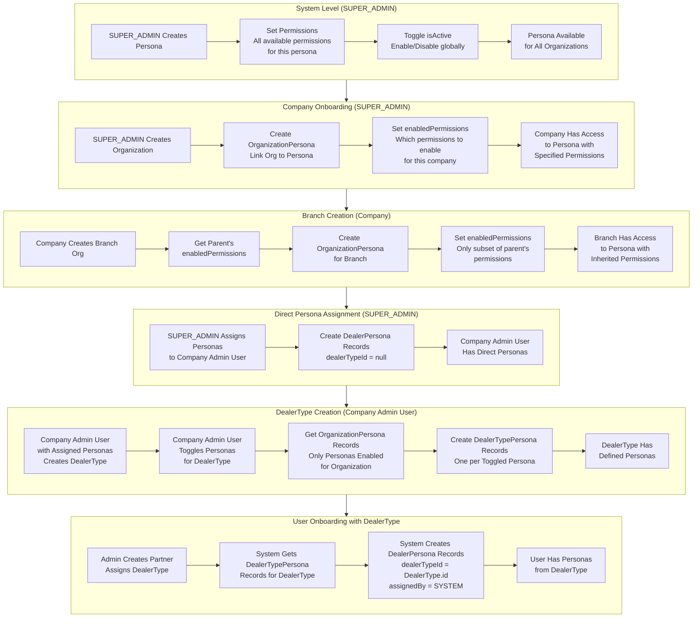
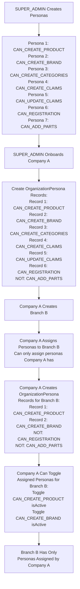
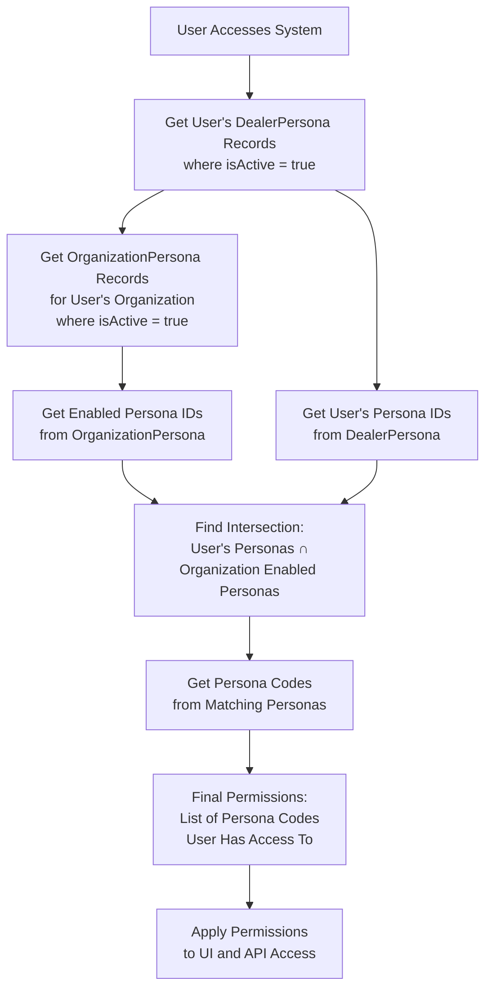
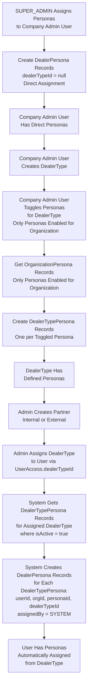
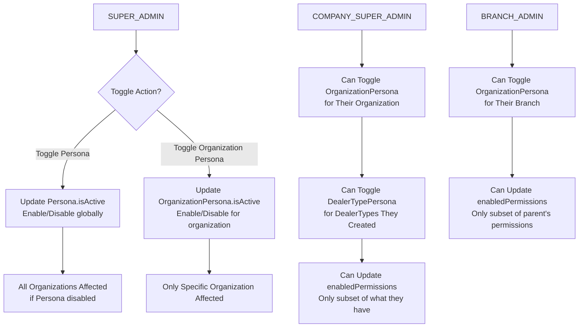

# Persona System - Complete Design Document

## Table of Contents

1. [Overview](#overview)
2. [Workflow](#workflow)
3. [Core Principles](#core-principles)
4. [Schema Models](#schema-models)
5. [System Flows](#system-flows)
6. [Design Decisions](#design-decisions)

---

## Overview

This document defines the complete Prisma schema design for a persona-based permission system that supports:

- **Persona table** for system-level persona definitions (created by SUPER_ADMIN)
- **OrganizationPersona table** for linking organizations to personas with permission inheritance
- **DealerPersona table** for linking users to personas (user-level persona assignment)
- **DealerTypePersona table** for linking dealer types to personas (defines which personas belong to a dealer type)
- **Permission inheritance** from parent organization to child organizations
- **Toggle mechanism** at both system and organization levels
- **DealerType-based assignment**: Personas automatically assigned when dealer type is assigned to user

### Key Requirements Fulfilled

✅ **Requirement 1**: SUPER_ADMIN creates and manages personas (toggle on/off)  
✅ **Requirement 2**: When onboarding company, Organization-Persona relation is created  
✅ **Requirement 3**: Permission inheritance - child organizations can only enable permissions assigned to parent  
✅ **Requirement 4**: Companies can toggle personas and permissions (only what they have)  
✅ **Requirement 5**: Users can be assigned personas via DealerPersona (bulk operations supported)  
✅ **Requirement 6**: SUPER_ADMIN can see and toggle all personas  
✅ **Requirement 7**: Direct persona assignment (without dealer type) for admin users  
✅ **Requirement 8**: DealerType creation with persona toggling  
✅ **Requirement 9**: Automatic persona assignment when dealer type is assigned to user

---

## Workflow

### Step-by-Step Workflow

**Phase 1: SUPER_ADMIN Creates Personas**

1. SUPER_ADMIN creates Persona entries (one persona = one permission):
   - Name (e.g., "Create Product", "Create Brand")
   - Label (display label for UI)
   - Code (unique identifier, e.g., "CAN_CREATE_PRODUCT", "CAN_CREATE_BRAND")
   - Description (what this permission allows)
   - Toggle `isActive` to enable/disable persona globally
2. Each persona represents a single permission
3. Personas are system-level and available to all organizations

**Phase 2: SUPER_ADMIN Onboards Company**

1. SUPER_ADMIN creates Organization (Company A)
2. SUPER_ADMIN creates OrganizationPersona records (one per enabled permission):
   - Links Organization to Persona
   - Creates multiple OrganizationPersona records for each enabled permission
   - Example: Enable "CAN_CREATE_PRODUCT", "CAN_CREATE_BRAND", "CAN_REGISTRATION" personas
   - Creates 3 OrganizationPersona records (one for each persona)
3. Company A now has access to the enabled personas (permissions)

**Phase 3: Company Creates Branch Organization**

1. Company A creates Branch Organization (Company B)
2. Company A assigns personas to Branch B (creates OrganizationPersona records):
   - Company A can only assign personas that Company A has enabled
   - Example: Company A has "CAN_CREATE_PRODUCT", "CAN_CREATE_BRAND", "CAN_REGISTRATION" enabled
   - Company A assigns to Branch B: "CAN_CREATE_PRODUCT", "CAN_CREATE_BRAND" (creates 2 OrganizationPersona records)
   - Company A does NOT assign "CAN_REGISTRATION" to Branch B
   - Company A cannot assign "CAN_ADD_PARTS" (Company A doesn't have it)
3. Company A can toggle assigned personas for Branch B:
   - Company A can toggle isActive for "CAN_CREATE_PRODUCT" and "CAN_CREATE_BRAND" (only the personas assigned to Branch B)
   - Company A cannot toggle "CAN_REGISTRATION" for Branch B (not assigned to Branch B)
   - Toggle action updates OrganizationPersona.isActive for Branch B
4. Permission inheritance enforced:
   - Branch B can only have personas explicitly assigned by Company A
   - Branch B cannot create new OrganizationPersona records (only parent can assign)
   - Branch B cannot toggle isActive (only parent can toggle)

**Phase 4: User Onboarding and Persona Assignment**

**4a. Direct Persona Assignment (Without DealerType) - For Admin Users**

1. SUPER_ADMIN assigns personas directly to Company Admin User
2. System creates DealerPersona record(s) WITHOUT dealerTypeId:
   - Links User to Persona within Organization
   - dealerTypeId = null (direct assignment)
   - Example: SUPER_ADMIN assigns "CAN_CREATE_PRODUCT", "CAN_CREATE_BRAND" to Company Admin User
3. User gets permissions from OrganizationPersona (filtered by what's enabled for that org)

**4b. DealerType Creation with Persona Assignment**

1. Company Admin User (who has been assigned personas by SUPER_ADMIN) creates DealerType
2. Company Admin User toggles personas to define which personas belong to this DealerType:
   - Company Admin User sees only personas enabled for their organization (from OrganizationPersona)
   - Company Admin User toggles personas (e.g., "CAN_CREATE_PRODUCT", "CAN_CREATE_BRAND", "CAN_REGISTRATION")
   - System creates DealerTypePersona records (one per enabled persona)
3. DealerType now has personas defined (stored in DealerTypePersona records)
4. Company Admin User can create multiple DealerTypes, each with different persona configurations

**4c. Automatic Persona Assignment via DealerType**

1. Admin creates Internal or External Partner and assigns DealerType (via UserAccess.dealerTypeId)
2. System automatically creates DealerPersona records:
   - Get DealerTypePersona records for the assigned DealerType
   - For each DealerTypePersona, create DealerPersona record:
     - Links User to Persona within Organization
     - Sets dealerTypeId to the assigned DealerType
     - Bulk operations supported (all personas from DealerType assigned at once)
3. User gets permissions from OrganizationPersona (filtered by what's enabled for that org)

**Phase 5: Permission Resolution**

1. When user accesses system:
   - System gets user's DealerPersona records (which personas/permissions are assigned to user)
   - System gets OrganizationPersona records (which personas/permissions are enabled for the organization)
   - System resolves final permissions: User's personas that are also enabled for organization
2. UI and API access controlled by resolved permissions (list of enabled persona codes)

---

## Core Principles

1. **One Persona = One Permission**: Each persona represents a single permission (e.g., CAN_CREATE_PRODUCT)
2. **System-Level Personas**: Personas are created by SUPER_ADMIN and are system-wide
3. **Organization-Persona Linking**: Each organization links to multiple personas via OrganizationPersona (one record per enabled persona)
4. **Permission Inheritance**: Child organizations can only enable personas that parent has enabled
5. **User-Persona Assignment**: Users are assigned personas via DealerPersona (can assign multiple personas, bulk operations supported)
6. **Toggle Control**: SUPER_ADMIN can toggle personas globally; Companies can toggle personas for their organization (only what they have)
7. **Permission Resolution**: Final permissions = User's personas that are enabled for the organization

---

## Schema Models

### 1. Persona

**Purpose**: System-level persona definitions created by SUPER_ADMIN. Each persona represents a single permission.

**Important**: One persona = One permission. Each persona is a toggleable permission that can be assigned to organizations and users.

```prisma
model Persona {
  // Primary ID
  id                      String    @id @default(dbgenerated("gen_random_uuid()")) @db.Uuid

  // Basic Information
  name                    String    @db.String  // e.g., "Create Product", "Create Brand"
  label                   String    @db.String  // Display label for UI (e.g., "Can Create Product")
  code                    String    @unique @db.String  // Unique permission code (e.g., "CAN_CREATE_PRODUCT", "CAN_CREATE_BRAND")
  description             String?   @db.String  // What this permission allows

  // Status
  isActive                Boolean   @default(true)  // Toggled by SUPER_ADMIN (enable/disable globally)

  // Metadata
  metadata                Json?     @db.JsonB  // Additional persona configuration (category, module, etc.)

  // Timestamps
  createdAt               DateTime  @default(now()) @db.Timestamptz
  updatedAt               DateTime  @updatedAt @db.Timestamptz

  // Soft Delete
  deletedAt               DateTime? @db.Timestamptz
  deletedBy               String?   @db.String

  // Relationships
  organizationPersonas    OrganizationPersona[]
  dealerPersonas          DealerPersona[]
  dealerTypePersonas      DealerTypePersona[]

  // Indexes
  @@index([code])
  @@index([isActive])
  @@index([createdAt])
}
```

**Key Features:**

- One persona = One permission (e.g., CAN_CREATE_PRODUCT)
- System-level personas (not organization-specific)
- Created and managed by SUPER_ADMIN
- `isActive` flag for global toggle (SUPER_ADMIN can enable/disable)
- `code` is unique permission identifier (used for programmatic checks)
- `label` is user-friendly display name for UI toggles

---

### 2. OrganizationPersona

**Purpose**: Links organizations to personas (permissions). One record per enabled persona per organization. Enforces permission inheritance from parent to child.

**Important**: Since one persona = one permission, each OrganizationPersona record represents one enabled permission for that organization. Multiple records = multiple enabled permissions.

```prisma
model OrganizationPersona {
  // Primary ID
  id                      String    @id @default(dbgenerated("gen_random_uuid()")) @db.Uuid

  // Organization
  orgId                   String    @db.Uuid

  // Persona (represents one permission)
  personaId               String    @db.Uuid

  // Status
  isActive                Boolean   @default(true)  // Toggled by admin/company (enable/disable this permission)

  // Who enabled this persona for the organization
  enabledBy               String    @db.String  // "SUPER_ADMIN" | "COMPANY_SUPER_ADMIN" | "BRANCH_ADMIN"
  enabledById             String?   @db.Uuid  // User ID who enabled it

  // Timestamps
  createdAt               DateTime  @default(now()) @db.Timestamptz
  updatedAt               DateTime  @updatedAt @db.Timestamptz

  // Soft Delete
  deletedAt               DateTime? @db.Timestamptz
  deletedBy               String?   @db.String

  // Relationships
  organization            Organization  @relation(fields: [orgId], references: [id], onDelete: Cascade)
  persona                 Persona       @relation(fields: [personaId], references: [id], onDelete: Restrict)

  // Indexes
  @@index([orgId])
  @@index([personaId])
  @@index([isActive])
  @@unique([orgId, personaId], name: "unique_org_persona")
}
```

**Key Features:**

- One record = One enabled permission for the organization
- Links Organization to Persona (permission)
- `isActive` flag to toggle permission on/off for the organization
- Child organizations can only enable personas that parent has enabled
- Tracks who enabled the persona (`enabledBy`, `enabledById`)
- Unique constraint: one persona per organization (prevents duplicates)

**Permission Inheritance Logic:**

- When Company A assigns personas to Branch B (creates OrganizationPersona records):
  - Get parent's enabled personas (OrganizationPersona records where isActive = true)
  - Get list of persona IDs from parent's OrganizationPersona records
  - Company A can only assign personas that Company A has enabled
  - System validates during creation - if Company A tries to assign persona they don't have → Validation Error
- After assignment, Company A can toggle isActive for assigned personas:
  - Company A can toggle isActive for OrganizationPersona records they created for Branch B
  - Branch B cannot create new OrganizationPersona records (only parent can assign)
  - Branch B cannot toggle personas (only parent can toggle)

---

### 3. DealerPersona

**Purpose**: Links users to personas (permissions) within an organization. Supports both direct assignment (without dealer type) and automatic assignment via dealer type. Users can have multiple personas (multiple permissions).

```prisma
model DealerPersona {
  // Primary ID
  id                      String    @id @default(dbgenerated("gen_random_uuid()")) @db.Uuid

  // User
  userId                  String    @db.Uuid

  // Organization
  orgId                   String    @db.Uuid

  // Persona (represents one permission)
  personaId               String    @db.Uuid

  // DealerType (optional - null if direct assignment, set if assigned via DealerType)
  dealerTypeId            String?   @db.Uuid

  // Status
  isActive                Boolean   @default(true)  // Toggle permission on/off for this user

  // Who assigned this persona to the user
  assignedBy              String    @db.String  // "SUPER_ADMIN" | "COMPANY_SUPER_ADMIN" | "BRANCH_ADMIN" | "SYSTEM" (for auto-assignment)
  assignedById            String?   @db.Uuid  // User ID who assigned it (null if SYSTEM auto-assignment)

  // Timestamps
  createdAt               DateTime  @default(now()) @db.Timestamptz
  updatedAt               DateTime  @updatedAt @db.Timestamptz

  // Soft Delete
  deletedAt               DateTime? @db.Timestamptz
  deletedBy               String?   @db.String

  // Relationships
  user                    User          @relation(fields: [userId], references: [id], onDelete: Cascade)
  organization            Organization  @relation(fields: [orgId], references: [id], onDelete: Cascade)
  persona                 Persona       @relation(fields: [personaId], references: [id], onDelete: Restrict)
  dealerType              DealerType?   @relation(fields: [dealerTypeId], references: [id], onDelete: SetNull)

  // Indexes
  @@index([userId])
  @@index([orgId])
  @@index([personaId])
  @@index([dealerTypeId])
  @@index([isActive])
  @@unique([userId, orgId, personaId], name: "unique_user_org_persona")
}
```

**Key Features:**

- Links User to Persona (permission) within Organization
- One record = One permission assigned to user
- Users can have multiple DealerPersona records (multiple permissions)
- **Two assignment methods:**
  - **Direct assignment**: dealerTypeId = null (for admin users assigned by SUPER_ADMIN)
  - **Automatic assignment**: dealerTypeId set (when dealer type is assigned to user)
- Supports bulk creation (assign same persona to multiple users, or multiple personas to one user)
- `isActive` flag to toggle permission on/off for the user
- Tracks who assigned the persona (or "SYSTEM" for auto-assignment)
- Unique constraint: prevents duplicate persona assignment to same user in same organization

**Permission Resolution:**

1. Get user's DealerPersona records (where isActive = true)
2. Get OrganizationPersona records for the organization (where isActive = true)
3. Final permissions = User's personas that are also enabled for organization
4. Result: List of persona codes (permissions) user has access to

---

### 4. DealerTypePersona

**Purpose**: Links dealer types to personas (permissions). Defines which personas belong to a dealer type. When a dealer type is assigned to a user, all personas from that dealer type are automatically assigned.

```prisma
model DealerTypePersona {
  // Primary ID
  id                      String    @id @default(dbgenerated("gen_random_uuid()")) @db.Uuid

  // DealerType
  dealerTypeId            String    @db.Uuid

  // Persona (represents one permission)
  personaId               String    @db.Uuid

  // Status
  isActive                Boolean   @default(true)  // Toggle persona on/off for this dealer type

  // Who assigned this persona to the dealer type
  assignedBy              String    @db.String  // "COMPANY_SUPER_ADMIN" | "BRANCH_ADMIN"
  assignedById            String?   @db.Uuid  // User ID who assigned it

  // Timestamps
  createdAt               DateTime  @default(now()) @db.Timestamptz
  updatedAt               DateTime  @updatedAt @db.Timestamptz

  // Soft Delete
  deletedAt               DateTime? @db.Timestamptz
  deletedBy               String?   @db.String

  // Relationships
  dealerType              DealerType  @relation(fields: [dealerTypeId], references: [id], onDelete: Cascade)
  persona                 Persona     @relation(fields: [personaId], references: [id], onDelete: Restrict)

  // Indexes
  @@index([dealerTypeId])
  @@index([personaId])
  @@index([isActive])
  @@unique([dealerTypeId, personaId], name: "unique_dealer_type_persona")
}
```

**Key Features:**

- Links DealerType to Persona (permission)
- One record = One permission assigned to dealer type
- Dealer types can have multiple DealerTypePersona records (multiple permissions)
- When creating/updating DealerType, admin toggles personas (creates/updates DealerTypePersona records)
- Admin can only assign personas that are enabled for their organization (from OrganizationPersona)
- `isActive` flag to toggle permission on/off for the dealer type
- Tracks who assigned the persona
- Unique constraint: prevents duplicate persona assignment to same dealer type

**Automatic Assignment Flow:**

1. When UserAccess.dealerTypeId is set (user assigned a dealer type)
2. System gets DealerTypePersona records for that DealerType (where isActive = true)
3. For each DealerTypePersona, create DealerPersona record:
   - userId = user ID
   - orgId = user's organization ID
   - personaId = DealerTypePersona.personaId
   - dealerTypeId = DealerType.id
   - assignedBy = "SYSTEM"
   - assignedById = null

**Note on DealerType Model:**

- The existing `DealerType` model has a `permissions` JSON field (legacy)
- With the new persona system, `DealerTypePersona` replaces the need for the JSON `permissions` field
- `DealerTypePersona` provides a structured, relational approach to managing dealer type permissions
- The `permissions` JSON field in `DealerType` can be deprecated or kept for backward compatibility

---

## System Flows

### Persona Creation and Assignment Flow



### Permission Inheritance Flow



### Permission Resolution Flow



### DealerType Persona Assignment Flow



### Toggle Flow



---

## Design Decisions

### 1. One Persona = One Permission

**Rationale**:

- Each persona represents a single, atomic permission
- Simplifies permission management and toggling
- Clear one-to-one mapping: Persona = Permission
- Easy to display as toggleable items in UI

**Implementation**:

- Persona table stores individual permissions (one record per permission)
- Each persona has: name, label, code, description, isActive
- Organizations enable personas via OrganizationPersona (one record per enabled permission)
- Users get personas via DealerPersona (one record per assigned permission)

**Benefit**:

- Simple, atomic permission model
- Easy to toggle individual permissions
- Clear permission inheritance (enable/disable specific personas)
- Scalable - add new permissions by creating new personas

### 2. OrganizationPersona for Permission Inheritance

**Rationale**:

- Each organization needs to control which permissions (personas) are enabled
- Child organizations should inherit only personas that parent has enabled
- Need to track who enabled what and when
- One record per enabled permission (persona)

**Implementation**:

- OrganizationPersona links Organization to Persona (one record = one enabled permission)
- Multiple OrganizationPersona records per organization (one for each enabled permission)
- When creating child's OrganizationPersona, validate that parent has that persona enabled
- `isActive` flag to toggle permission on/off for the organization

**Benefit**:

- Clear permission inheritance chain
- Child cannot enable personas parent doesn't have
- Easy to see which permissions are enabled (query OrganizationPersona where isActive = true)
- Audit trail of permission assignments

### 3. DealerPersona for User Assignment

**Rationale**:

- Users need to be assigned personas (permissions)
- Support both direct assignment (without dealer type) and automatic assignment via dealer type
- Support bulk assignment during onboarding
- Users can have multiple personas (multiple permissions)
- One record per permission assigned to user
- Track assignment source (direct vs dealer type)

**Implementation**:

- DealerPersona links User to Persona within Organization
- One record = One permission assigned to user
- **Two assignment methods:**
  - **Direct assignment**: dealerTypeId = null (for admin users)
  - **Automatic assignment**: dealerTypeId set (when dealer type assigned to user)
- Supports bulk creation:
  - Assign same persona to multiple users (create multiple DealerPersona records)
  - Assign multiple personas to one user (create multiple DealerPersona records)
  - Auto-assign all personas from dealer type (when dealer type assigned)
- `isActive` flag to toggle permission on/off for the user
- `assignedBy` tracks who assigned (or "SYSTEM" for auto-assignment)

**Benefit**:

- Flexible user assignment (multiple permissions per user)
- Supports both direct and dealer-type-based assignment
- Bulk operations supported (assign personas to multiple users at once)
- Automatic assignment when dealer type is assigned
- Easy to manage user permissions (toggle individual permissions)
- Clear permission model (one record per permission)

### 4. DealerTypePersona for DealerType Configuration

**Rationale**:

- Dealer types need to define which personas (permissions) they include
- Company admins should be able to toggle personas when creating/updating dealer types
- When dealer type is assigned to user, personas should be automatically assigned
- One record per permission assigned to dealer type

**Implementation**:

- DealerTypePersona links DealerType to Persona
- One record = One permission assigned to dealer type
- When creating/updating DealerType, admin toggles personas (creates/updates DealerTypePersona records)
- Admin can only assign personas that are enabled for their organization (from OrganizationPersona)
- `isActive` flag to toggle permission on/off for the dealer type
- When UserAccess.dealerTypeId is set, system automatically creates DealerPersona records from DealerTypePersona

**Benefit**:

- Clear dealer type configuration (which personas belong to which dealer type)
- Easy to manage dealer type permissions (toggle personas)
- Automatic persona assignment when dealer type is assigned
- Consistent permission model (one record per permission)

### 5. Permission Resolution Strategy

**Rationale**:

- Need clear hierarchy: User's Personas → Organization's Enabled Personas
- Final permissions should be intersection of user's personas and organization's enabled personas
- User can only have permissions that organization has enabled

**Implementation**:

- Get user's DealerPersona records (where isActive = true) → List of persona IDs
- Get organization's OrganizationPersona records (where isActive = true) → List of persona IDs
- Find intersection: User's persona IDs ∩ Organization's persona IDs
- Get persona codes from matching personas → Final permissions list

**Benefit**:

- Clear permission resolution (simple intersection)
- Security through validation (user can't have permission org doesn't have)
- Efficient querying (simple joins and filters)

### 6. Toggle Mechanism

**Rationale**:

- SUPER_ADMIN needs global control
- Companies need organization-level control
- Need to track who toggled what

**Implementation**:

- Persona.isActive: Global toggle by SUPER_ADMIN
- OrganizationPersona.isActive: Organization-level toggle
- Track `enabledBy` and `assignedBy` fields

**Benefit**:

- Granular control at different levels
- Audit trail of changes
- Flexible enable/disable without deletion

---

## Permission Inheritance Rules

### Rule 1: Parent-Child Permission Inheritance

**When Company A assigns personas to Branch B (creates OrganizationPersona records):**

1. Get parent organization's enabled personas (OrganizationPersona records where isActive = true)
2. Get list of persona IDs from parent's OrganizationPersona records
3. Company A can only assign personas that Company A has enabled
4. System validates during creation - if Company A tries to assign persona they don't have → Validation Error
5. After assignment, Company A can toggle isActive for assigned personas

**Example:**

- Company A has enabled personas: [CAN_CREATE_PRODUCT, CAN_CREATE_BRAND, CAN_REGISTRATION] (3 OrganizationPersona records where isActive = true)
- **Step 1 - Assignment**: Company A assigns to Branch B: [CAN_CREATE_PRODUCT, CAN_CREATE_BRAND] (creates 2 OrganizationPersona records for Branch B with isActive = true/false)
- **Step 2 - Toggle**: Company A can now toggle isActive for: CAN_CREATE_PRODUCT, CAN_CREATE_BRAND (only the personas assigned to Branch B)
- Branch B cannot have: CAN_REGISTRATION (not assigned by Company A), CAN_ADD_PARTS (Company A doesn't have it)
- Branch B cannot create new OrganizationPersona records (only Company A can assign)
- Branch B cannot toggle isActive (only Company A can toggle)

### Rule 2: Permission Resolution

**Final user permissions = Intersection of:**

1. User's DealerPersona records (where isActive = true) → List of persona IDs
2. Organization's OrganizationPersona records (where isActive = true) → List of persona IDs
3. Find matching persona IDs → Get persona codes → Final permissions list

**Example:**

- User has DealerPersona records: [CAN_CREATE_PRODUCT, CAN_CREATE_BRAND, CAN_ADD_PARTS]
- Organization has OrganizationPersona records: [CAN_CREATE_PRODUCT, CAN_CREATE_BRAND]
- User's final permissions: [CAN_CREATE_PRODUCT, CAN_CREATE_BRAND] (CAN_ADD_PARTS filtered out - org doesn't have it)

### Rule 3: Toggle Hierarchy

**SUPER_ADMIN:**

- Can toggle Persona.isActive (affects all organizations - enables/disables persona globally)
- Can create/delete OrganizationPersona records for any organization
- Can toggle OrganizationPersona.isActive for any organization
- Can see all personas in the system

**COMPANY_SUPER_ADMIN:**

- Can see only personas enabled for their organization (from OrganizationPersona)
- Can create/delete OrganizationPersona records for their organization (only personas they have)
- Can toggle OrganizationPersona.isActive for their organization
- Can assign personas to child organizations (create OrganizationPersona records for children)
- Can toggle OrganizationPersona.isActive for child organizations (only personas they assigned)
- Can create DealerTypes and toggle personas for those DealerTypes (only personas enabled for their organization)
- Can toggle DealerTypePersona.isActive for DealerTypes they created
- Cannot toggle Persona.isActive (system-level only)
- Cannot assign personas they don't have

**Company Admin User (with assigned personas):**

- Has personas directly assigned by SUPER_ADMIN (via DealerPersona, dealerTypeId = null)
- Can create DealerTypes and toggle personas to define which personas belong to each DealerType
- Can only toggle personas that are enabled for their organization (from OrganizationPersona)
- When creating/updating DealerType, system creates/updates DealerTypePersona records
- Can create multiple DealerTypes, each with different persona configurations

**BRANCH_ADMIN:**

- Can see only personas assigned to their branch by parent (from OrganizationPersona)
- Cannot create OrganizationPersona records (only parent can assign)
- Cannot toggle OrganizationPersona.isActive (only parent can toggle)
- Can create DealerTypes and toggle personas (only personas enabled for their branch)
- Can toggle DealerTypePersona.isActive for DealerTypes they created
- Cannot toggle Persona.isActive
- Cannot assign new personas (only parent can assign)

**DealerType Persona Assignment Rules:**

- When creating/updating DealerType, admin can only toggle personas that are enabled for their organization (from OrganizationPersona)
- System validates during DealerTypePersona creation - if admin tries to assign persona not enabled for organization → Validation Error
- When UserAccess.dealerTypeId is set, system automatically creates DealerPersona records from DealerTypePersona
- If DealerType is removed from user (UserAccess.dealerTypeId set to null), associated DealerPersona records can be soft-deleted or marked inactive

---

## Summary

This design supports your complete persona system:

✅ **SUPER_ADMIN** creates personas (one persona = one permission) and toggles them globally  
✅ **SUPER_ADMIN** onboards companies and creates OrganizationPersona records (enables permissions)  
✅ **SUPER_ADMIN** assigns personas directly to Company Admin Users (without dealer type)  
✅ **Companies** can only enable personas (permissions) assigned to them  
✅ **Child organizations** inherit only parent's enabled personas  
✅ **Company Admin Users** create DealerTypes and toggle personas to define which personas belong to each dealer type  
✅ **Users** are assigned personas via DealerPersona (direct assignment or automatic via dealer type)  
✅ **Automatic assignment** - When dealer type is assigned to user, all personas from dealer type are automatically assigned  
✅ **Permission resolution** follows clear hierarchy: User's Personas ∩ Organization's Enabled Personas  
✅ **Toggle mechanism** at system level (Persona.isActive), organization level (OrganizationPersona.isActive), and dealer type level (DealerTypePersona.isActive)  
✅ **UI Display** - Personas displayed as toggleable items (label, description, isActive)

The schema is clean, maintains permission inheritance, supports bulk operations, and provides audit trails for all persona assignments. Each persona represents a single permission, making it easy to manage and toggle individual permissions.
